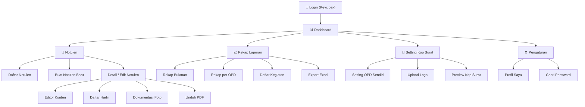

# APP_FLOW.md — Alur Aplikasi e-Notulen

## 📐 Sitemap Overview



---

## 🗂️ Route Structure (Next.js App Router)

```
/                           → Redirect ke /dashboard
/auth/login                 → Halaman login (redirect ke Keycloak)
/auth/callback              → Handle callback dari Keycloak
/auth/logout                → Handle logout

/dashboard                  → Dashboard utama (overview)

/notulen                    → Daftar semua notulen
/notulen/create             → Form buat notulen baru
/notulen/[id]               → Detail notulen (read-only view)
/notulen/[id]/edit          → Edit notulen (editor)

/reports                    → Rekap laporan
/reports/monthly            → Rekap bulanan
/reports/opd                → Rekap per OPD (Admin only)
/reports/activities         → Daftar kegiatan rapat

/settings/opd               → Setting kop surat OPD (Admin/Operator)
/settings/profile           → Profil saya (read-only, dari JWT)
```

> **Note**: Tidak ada route `/admin/users` atau `/admin/opd` — manajemen user dilakukan via Keycloak Admin Console, data OPD dari API external.

---

## 🔐 Alur 1: Login & Authentication

```
┌─────────────────────────────────────────────────────────────────┐
│                         ALUR LOGIN                              │
└─────────────────────────────────────────────────────────────────┘

   User mengakses e-Notulen
          │
          ▼
   ┌──────────────┐     Ya      ┌──────────────┐
   │ Sudah login? │────────────▶│  Dashboard    │
   │ (token valid) │             └──────────────┘
   └──────┬───────┘
          │ Tidak
          ▼
   ┌──────────────┐
   │  Halaman     │
   │  Login       │
   │  e-Notulen   │
   └──────┬───────┘
          │ Klik "Masuk"
          ▼
   ┌────────────────────────────┐
   │  Redirect ke Keycloak      │
   │  accounts.purbalinggakab   │
   │  .go.id/auth/realms/apps   │
   │  /protocol/openid-connect  │
   │  /auth?client_id=e-notulen │
   └──────────┬─────────────────┘
              │ Input username & password
              ▼
   ┌──────────────┐     Gagal   ┌──────────────┐
   │  Keycloak    │────────────▶│  Error:      │
   │  Validasi    │             │  Coba lagi   │
   └──────┬───────┘             └──────────────┘
          │ Berhasil
          ▼
   ┌──────────────────────────────────────┐
   │  Callback ke e-Notulen               │
   │  + Exchange code → JWT tokens        │
   │                                      │
   │  JWT berisi:                         │
   │  ┌────────────────────────────────┐  │
   │  │ Admin:                         │  │
   │  │  sub, name, role=admin         │  │
   │  │  (tidak ada kode_unit)         │  │
   │  ├────────────────────────────────┤  │
   │  │ Operator:                      │  │
   │  │  sub, name, kode_unit="T8"     │  │
   │  │  role=operator                 │  │
   │  ├────────────────────────────────┤  │
   │  │ Officer:                       │  │
   │  │  sub, name, officer={nip,      │  │
   │  │  unit, jabatan, ...}           │  │
   │  │  role=officer                  │  │
   │  └────────────────────────────────┘  │
   └──────────┬───────────────────────────┘
              │
              ▼
   ┌──────────────┐
   │  Set token   │  HttpOnly cookie
   │  di cookie   │  
   └──────┬───────┘
          │
          ▼
   ┌──────────────┐
   │  Redirect ke │
   │  Dashboard   │
   └──────────────┘
```

---

## 📊 Alur 2: Dashboard

```
┌─────────────────────────────────────────────────────────────────┐
│                      HALAMAN DASHBOARD                          │
│                                                                 │
│  Selamat datang, Rafli Firdausy Irawan 👋                       │
│  Dinas Komunikasi dan Informatika                               │
│                                                                 │
│  ┌─────────────┐  ┌─────────────┐  ┌─────────────┐            │
│  │ Total       │  │ Bulan Ini   │  │ Draft /     │            │
│  │ Notulen     │  │             │  │ Final       │            │
│  │    156      │  │     12      │  │  8 / 148    │            │
│  └─────────────┘  └─────────────┘  └─────────────┘            │
│                                                                 │
│  ┌──────────────────────────────────────────────┐              │
│  │  📊 Grafik Notulen per Bulan (12 bulan)      │              │
│  │  ▓▓▓▓░░▓▓▓▓▓▓▓▓░░▓▓▓▓▓▓▓▓▓▓▓▓▓▓░░▓▓▓▓▓▓  │              │
│  └──────────────────────────────────────────────┘              │
│                                                                 │
│  ┌──────────────────────────────────────────────┐              │
│  │  📝 Notulen Terbaru                          │              │
│  │  ┌────────────────────────────────────────┐  │              │
│  │  │ Rapat Evaluasi Quick Win Smart City    │  │              │
│  │  │ 📅 13 Maret 2025  │ 🏢 Dinkominfo     │  │              │
│  │  │ Status: ✅ Final                        │  │              │
│  │  ├────────────────────────────────────────┤  │              │
│  │  │ Rapat Koordinasi SPBE                  │  │              │
│  │  │ 📅 10 Maret 2025  │ 🏢 Dinkominfo     │  │              │
│  │  │ Status: 📝 Draft                       │  │              │
│  │  └────────────────────────────────────────┘  │              │
│  └──────────────────────────────────────────────┘              │
│                                                                 │
│  ┌──────────────┐                                               │
│  │ ➕ Buat      │  (Quick Action Button)                        │
│  │   Notulen    │                                               │
│  └──────────────┘                                               │
│                                                                 │
└─────────────────────────────────────────────────────────────────┘
```

### Dashboard Data per Role

| Data                      | Admin              | Operator           | Officer            |
| ------------------------- | ------------------ | ------------------ | ------------------ |
| Greeting name             | "Super Admin"      | Nama OPD           | Nama Pegawai       |
| Total Notulen             | Semua OPD          | OPD sendiri        | Milik sendiri      |
| Grafik per Bulan          | Semua OPD          | OPD sendiri        | Milik sendiri      |
| Grafik per OPD            | ✅ Tampil           | ❌ Tidak tampil     | ❌ Tidak tampil     |
| Notulen Terbaru           | Semua OPD          | OPD sendiri        | Milik sendiri      |

---

## 📝 Alur 3: Buat Notulen Baru

```
┌─────────────────────────────────────────────────────────────────┐
│                    ALUR BUAT NOTULEN BARU                       │
└─────────────────────────────────────────────────────────────────┘

   Klik "Buat Notulen" (dari Dashboard / Daftar Notulen)
          │
          ▼
   ┌──────────────────────────────────────────────────────┐
   │              FORM METADATA NOTULEN                    │
   │                                                       │
   │  Judul Rapat *    : [________________________________]│
   │  Hari, Tanggal *  : [📅 Date Picker________________] │
   │  Waktu Mulai      : [🕐 09:00__] s/d [🕐 Selesai___]│
   │  Tempat            : [________________________________]│
   │  Dipimpin Oleh     : [________________________________]│
   │  Jabatan Pimpinan  : [________________________________]│
   │  NIP Pimpinan      : [________________________________]│
   │  Nama Notulis      : [________________________________]│
   │  Jabatan Notulis   : [________________________________]│
   │  NIP Notulis       : [________________________________]│
   │  OPD              : [Auto-filled dari JWT___________] │
   │                     (Admin: dropdown dari API SKPD)   │
   │  Tipe Input       : (o) Tulis Langsung (Editor)       │
   │                     ( ) Upload File (PDF/Docx)        │
   │                                                       │
   │            [Batal]  [Buat & Lanjutkan →]              │
   └──────────────────────────────────────────────────────┘
          │
          │ Klik "Buat & Lanjutkan"
          ▼
   ┌──────────────┐
   │  Simpan ke   │  Status: "Draft"
   │  Database    │  opd_code & opd_name dari JWT
   │              │  created_by_sub & created_by_name dari JWT
   └──────┬───────┘
          │
          ▼
   ┌──────────────────────────────────────────────────────┐
   │            HALAMAN DETAIL/EDITOR NOTULEN              │
   │                                                       │
   │  ┌────────────────────────────────────────────────┐  │
   │  │  Tab: [📝 Isi Notulen] [👥 Daftar Hadir]      │  │
   │  │       [📷 Dokumentasi]  [ℹ️ Metadata]          │  │
   │  └────────────────────────────────────────────────┘  │
   │                                                       │
   │  (Jika Tulis Langsung → Tampil Editor Tiptap)        │
   │  (Jika Upload File → Tampil Form Upload File PDF)     │
   │                                                       │
   └──────────────────────────────────────────────────────┘
```

### Auto-Fill Logic per Role

| Field        | Admin                    | Operator                              | Officer                                      |
| ------------ | ------------------------ | ------------------------------------- | -------------------------------------------- |
| OPD          | Pilih dari dropdown API  | Auto: JWT `kode_unit` + `name`        | Auto: JWT `officer.unit.id` + `unit.nama`    |
| Notulis Nama | Manual input             | Manual input                          | Auto-fill: JWT `officer.nama`                |
| Notulis NIP  | Manual input             | Manual input                          | Auto-fill: JWT `officer.nip`                 |
| Notulis Jab  | Manual input             | Manual input                          | Auto-fill: JWT `officer.jab.nama`            |

---

## ✏️ Alur 4: Editor Notulen (Detail)

```
┌─────────────────────────────────────────────────────────────────┐
│                     HALAMAN EDITOR NOTULEN                      │
│                                                                 │
│  ┌─ Header ────────────────────────────────────────────────┐   │
│  │  ◀ Kembali    Rapat Evaluasi Quick Win...    💾 Tersimpan│   │
│  │               Status: [Draft ▼]               [Unduh PDF]│   │
│  └─────────────────────────────────────────────────────────┘   │
│                                                                 │
│  ┌─ Tab Navigation ───────────────────────────────────────┐    │
│  │  [📝 Isi Notulen] [👥 Daftar Hadir]                    │    │
│  │  [📷 Dokumentasi]  [ℹ️ Metadata]                       │    │
│  └────────────────────────────────────────────────────────┘    │
│                                                                 │
│  ═══════════════════════════════════════════════════════════    │
│                                                                 │
│  Tab 1: ISI NOTULEN (Active)                                   │
│                                                                 │
│  [Jika Tipe Input: Tulis Langsung (Editor)]                     │
│  ┌─ Toolbar ──────────────────────────────────────────────┐    │
│  │ B  I  U  S  │ H1 H2 H3 │ •  1. │ ≡  ≡  ≡ │ ↩  ↪    │    │
│  └────────────────────────────────────────────────────────┘    │
│  ┌─ Editor Area (Tiptap) ────────────────────────────────┐    │
│  │                                                        │    │
│  │  Pembahasan:                                           │    │
│  │                                                        │    │
│  │  1. Evaluasi progress Smart City tahun 2024            │    │
│  │     • Dimensi Smart Governance sudah berjalan baik     │    │
│  │     • Dimensi Smart Branding perlu ditingkatkan        │    │
│  │                                                        │    │
│  │  2. Rencana Aksi Quick Win 2025                        │    │
│  │     • Fokus di infrastruktur DPUPR                     │    │
│  │     • Renaksi Prosalingga perlu ditambah               │    │
│  │       pendampingan                                     │    │
│  │                                                        │    │
│  │  Kesimpulan:                                           │    │
│  │  • 2025 fokus di infrastruktur                         │    │
│  │  • KEEP nyambung dengan SPEKTA                         │    │
│  │  • 2 bulan ke depan diadakan rapat lagi                │    │
│  │                                                        │    │
│  │  [Mulai menulis isi notulen...]          ← placeholder │    │
│  │                                                        │    │
│  └────────────────────────────────────────────────────────┘    │
│                                                                 │
│  [Jika Tipe Input: Upload File]                                 │
│  ┌────────────────────────────────────────────────────────┐    │
│  │                                                        │    │
│  │     📁 Klik atau Drag & Drop file notulen di sini       │    │
│  │        Format didukung: PDF, DOCX (Max: 10MB)          │    │
│  │                                                        │    │
│  │        [Upload File]                                   │    │
│  │                                                        │    │
│  │     File saat ini: Notulen_Rapat_Evaluasi.pdf (2.4MB)   │    │
│  │     [👁️ Preview PDF]   [🗑️ Hapus & Upload Ulang]         │    │
│  │                                                        │    │
│  └────────────────────────────────────────────────────────┘    │
│                                                                 │
└─────────────────────────────────────────────────────────────────┘
```

### Tab 2: Daftar Hadir

```
┌─────────────────────────────────────────────────────────────────┐
│  Tab 2: DAFTAR HADIR                                            │
│                                                                 │
│  Jumlah Peserta: 21 orang              [➕ Tambah Peserta]      │
│                                                                 │
│  ┌────┬──────────────────────┬────────────────────┬────────┐   │
│  │ No │ Nama                 │ Instansi           │ Aksi   │   │
│  ├────┼──────────────────────┼────────────────────┼────────┤   │
│  │ 1  │ Wely Andika          │ Inspektorat        │ ✏️ 🗑️  │   │
│  │ 2  │ Haris Fadila         │ Bakeuda            │ ✏️ 🗑️  │   │
│  │ 3  │ Dwi Prihta Pambudi   │ BKPSDM             │ ✏️ 🗑️  │   │
│  │ 4  │ Kustinah             │ Bakesbangpol       │ ✏️ 🗑️  │   │
│  │ 5  │ Zakia W              │ DPUPR              │ ✏️ 🗑️  │   │
│  │ .. │ ...                  │ ...                │ ...    │   │
│  └────┴──────────────────────┴────────────────────┴────────┘   │
│                                                                 │
│  ┌─ Tambah Peserta ────────────────────────────────────────┐   │
│  │  Nama *    : [________________________________]          │   │
│  │  Instansi  : [________________________________]          │   │
│  │  Jabatan   : [________________________________]          │   │
│  │                              [Batal] [Tambah]            │   │
│  └──────────────────────────────────────────────────────────┘   │
│                                                                 │
└─────────────────────────────────────────────────────────────────┘
```

### Tab 3: Dokumentasi Foto

```
┌─────────────────────────────────────────────────────────────────┐
│  Tab 3: DOKUMENTASI FOTO                                        │
│                                                                 │
│  ┌──────────────────────────────────────────────────────────┐  │
│  │  📁 Drag & drop foto di sini, atau klik untuk memilih    │  │
│  │     Format: JPG, PNG  │  Max: 10MB/foto  │  Max: 20 foto │  │
│  └──────────────────────────────────────────────────────────┘  │
│                                                                 │
│  ┌──────────┐  ┌──────────┐  ┌──────────┐  ┌──────────┐      │
│  │          │  │          │  │          │  │          │      │
│  │  📷 1    │  │  📷 2    │  │  📷 3    │  │  📷 4    │      │
│  │          │  │          │  │          │  │          │      │
│  │   [🗑️]   │  │   [🗑️]   │  │   [🗑️]   │  │   [🗑️]   │      │
│  └──────────┘  └──────────┘  └──────────┘  └──────────┘      │
│                                                                 │
│  4 foto terupload                                               │
│                                                                 │
└─────────────────────────────────────────────────────────────────┘
```

### Tab 4: Metadata

```
┌─────────────────────────────────────────────────────────────────┐
│  Tab 4: METADATA                                                │
│                                                                 │
│  Informasi Rapat                                                │
│  ┌──────────────────────────────────────────────────────────┐  │
│  │  Judul Rapat *    : [Rapat Evaluasi Quick Win Smart...] │  │
│  │  Hari, Tanggal *  : [📅 Kamis, 13 Maret 2025_________] │  │
│  │  Waktu Mulai      : [🕐 09:00________________________] │  │
│  │  Waktu Selesai    : [🕐 Selesai_______________________] │  │
│  │  Tempat           : [Aula Dinkominfo Purbalingga______] │  │
│  │  OPD              : Dinas Komunikasi dan Informatika    │  │
│  │                     (auto-filled, read-only)            │  │
│  └──────────────────────────────────────────────────────────┘  │
│                                                                 │
│  Pimpinan Rapat                                                 │
│  ┌──────────────────────────────────────────────────────────┐  │
│  │  Nama             : [Baryati, S.Kom.___________________]│  │
│  │  Jabatan          : [Kepala Bidang Informatika_________]│  │
│  │  NIP              : [19751206 199903 2003______________]│  │
│  └──────────────────────────────────────────────────────────┘  │
│                                                                 │
│  Notulis                                                        │
│  ┌──────────────────────────────────────────────────────────┐  │
│  │  Nama             : [Ratih Ratna Dewi, S.Kom.__________]│  │
│  │  Jabatan          : [Pelaksana Bidang Informatika______]│  │
│  │  NIP              : [-________________________________]│  │
│  └──────────────────────────────────────────────────────────┘  │
│                                                                 │
│                                           [Simpan Perubahan]    │
│                                                                 │
└─────────────────────────────────────────────────────────────────┘
```

---

## 🔄 Alur 5: Auto-Save Flow

```
┌─────────────────────────────────────────────────────────────────┐
│                       ALUR AUTO-SAVE                            │
└─────────────────────────────────────────────────────────────────┘

   User mengetik di Tiptap Editor
          │
          ▼
   ┌──────────────┐
   │  onChange     │  Setiap ada perubahan content
   │  triggered    │
   └──────┬───────┘
          │
          ▼
   ┌──────────────┐
   │  Reset       │  Timer direset setiap kali user ketik
   │  Debounce    │  (2 detik)
   │  Timer       │
   └──────┬───────┘
          │ 2 detik tanpa ketik
          ▼
   ┌──────────────┐
   │  Check       │  Pastikan tidak terlalu sering
   │  Throttle    │  (min 5 detik antar save)
   │  (5 detik)   │
   └──────┬───────┘
          │
          ▼
   ┌──────────────┐
   │  UI: Show    │  Status berubah ke "⏳ Menyimpan..."
   │  "Menyimpan" │
   └──────┬───────┘
          │
          ▼
   ┌──────────────┐
   │  POST        │  Kirim Tiptap JSON content ke API
   │  /auto-save  │  + saved_by_sub & saved_by_name dari JWT
   └──────┬───────┘
          │
          ├───── Berhasil ────▶ UI: "💾 Tersimpan" (fade in, 3 detik)
          │
          └───── Gagal ───────▶ Retry (3x, exponential backoff)
                                    │
                                    ├── Retry berhasil → "💾 Tersimpan"
                                    │
                                    └── Semua retry gagal → "❌ Gagal menyimpan"
                                                            + [Coba lagi] button
```

---

## 📋 Alur 6: Daftar Notulen & Pencarian

```
┌─────────────────────────────────────────────────────────────────┐
│                     HALAMAN DAFTAR NOTULEN                      │
│                                                                 │
│  ┌─ Search & Filter Bar ──────────────────────────────────┐    │
│  │  🔍 [Cari notulen...___________________]                │    │
│  │                                                         │    │
│  │  Filter:                                                │    │
│  │  [OPD: Semua ▼] (Admin only)  [Status: Semua ▼]        │    │
│  │  [📅 Dari: ___________]  [📅 Sampai: ___________]      │    │
│  │                                                         │    │
│  │  Sort: [Tanggal terbaru ▼]        [➕ Buat Notulen]     │    │
│  └─────────────────────────────────────────────────────────┘    │
│                                                                 │
│  ┌─ Notulen List ─────────────────────────────────────────┐    │
│  │                                                         │    │
│  │  ┌─────────────────────────────────────────────────┐   │    │
│  │  │ 📝 Rapat Evaluasi Quick Win Smart City          │   │    │
│  │  │    Kabupaten Purbalingga                         │   │    │
│  │  │ 📅 Kamis, 13 Maret 2025  │  🏢 Dinkominfo       │   │    │
│  │  │ 👤 Baryati, S.Kom.       │  👥 21 peserta       │   │    │
│  │  │ Status: ✅ Final                                 │   │    │
│  │  │                     [Lihat] [Edit] [Unduh] [🗑️]  │   │    │
│  │  └─────────────────────────────────────────────────┘   │    │
│  │                                                         │    │
│  │  ┌─────────────────────────────────────────────────┐   │    │
│  │  │ 📝 Rapat Koordinasi SPBE Kabupaten              │   │    │
│  │  │ 📅 Senin, 10 Maret 2025  │  🏢 Dinkominfo       │   │    │
│  │  │ 👤 Ahmad, S.T.           │  👥 15 peserta       │   │    │
│  │  │ Status: 📝 Draft                                 │   │    │
│  │  │                     [Lihat] [Edit] [Unduh] [🗑️]  │   │    │
│  │  └─────────────────────────────────────────────────┘   │    │
│  │                                                         │    │
│  │  Menampilkan 1-10 dari 156 notulen                      │    │
│  │  [◀ Prev] [1] [2] [3] ... [16] [Next ▶]               │    │
│  └─────────────────────────────────────────────────────────┘    │
│                                                                 │
└─────────────────────────────────────────────────────────────────┘
```

### Data Filtering per Role (Automatic)

```
   API GET /notulen
          │
          ▼
   ┌──────────────┐
   │  Middleware   │  Extract role & OPD code dari JWT
   │  Auth Check   │
   └──────┬───────┘
          │
          ├── Admin  ──────▶ WHERE deleted_at IS NULL
          │                  (semua notulen, bisa filter by opd_code)
          │
          ├── Operator ────▶ WHERE opd_code = 'T8'     ← dari JWT kode_unit
          │                  AND deleted_at IS NULL
          │
          └── Officer ─────▶ WHERE created_by_sub = 'uuid...'  ← dari JWT sub
                             AND deleted_at IS NULL
```

---

## 📥 Alur 7: Unduh PDF

```
┌─────────────────────────────────────────────────────────────────┐
│                       ALUR UNDUH PDF                            │
└─────────────────────────────────────────────────────────────────┘

   Klik tombol "Unduh PDF" di detail/list notulen
          │
          ▼
   ┌──────────────┐
   │  Loading     │  "Generating PDF..."
   │  Indicator   │
   └──────┬───────┘
          │
          ▼
   ┌──────────────┐
   │  Backend     │  GET /notulen/:id/download
   │  Backend     │  GET /notulen/:id/download
   │  Proses      │
   └──────┬───────┘
          │
          ├── [Jika Tipe Input = Tulis Langsung (Editor)]
          │   ├── 1. Query notulen data (metadata, content, attendees)
          ├── 2. Query opd_settings (logo, kop surat config) by opd_code
          ├── 3. Query attachments (foto dokumentasi)
          ├── 4. Fetch logo from MinIO (presigned URL)
          ├── 5. Render PDF:
          │      ├── Halaman 1+: Kop surat + Notulen
          │      │   ├── Kop surat OPD (logo + nama instansi + alamat)
          │      │   ├── Garis pembatas (double line)
          │      │   ├── Judul: "NOTULEN"
          │      │   ├── Nama rapat
          │      │   ├── Metadata (tanggal, waktu, tempat, pimpinan)
          │      │   ├── Daftar hadir (numbered list: nama — instansi)
          │      │   ├── Isi notulen (Tiptap JSON → PDF rich text)
          │      │   └── Blok tanda tangan:
          │      │       ├── Lokasi + Tanggal (kanan atas)
          │      │       ├── Kiri: Pimpinan Rapat (nama, pangkat, NIP)
          │      │       └── Kanan: Notulis (nama, jabatan, NIP)
          │      │
          │      └── Halaman terakhir: Dokumentasi (jika ada foto)
          │          ├── Judul: "DOKUMENTASI KEGIATAN"
          │          ├── Info rapat (nama, tanggal, waktu)
          │          └── Grid foto (2 kolom)
          │
          │
          │
          └── [Jika Tipe Input = Upload File]
              ├── 1. Query notulen data (file_url)
              ├── 2. Generate presigned URL dari MinIO (expire 1 jam)
              └── 3. Redirect / Return presigned URL
          
          ▼
   ┌──────────────┐
   │  Download    │  Browser auto download file
   │  File        │  (PDF hasil generate ATAU file asli docx/pdf)
   └──────────────┘
```

### Struktur Output (Jika Generate PDF)

```
┌─────────────────────────────────────┐
│  [Logo]  PEMERINTAH KABUPATEN       │  ← Kop Surat (dari opd_settings)
│          PURBALINGGA                │
│          DINAS KOMUNIKASI DAN ...    │
│          Jl. Letkol Isdiman ...     │
│  ═══════════════════════════════    │  ← Garis pembatas
│                                     │
│              NOTULEN                 │  ← Judul
│  RAPAT EVALUASI QUICK WIN ...       │  ← Nama rapat
│                                     │
│  Hari, Tanggal  : Kamis, 13 ...     │  ← Metadata
│  Waktu          : 09.00 WIB - ...   │
│  Tempat         : Aula Dinkominfo   │
│  Dipimpin Oleh  : Baryati, S.Kom.,  │
│                   Kab. Informatika   │
│                                     │
│  Dihadiri Oleh  :                   │  ← Daftar Hadir
│  1. Wely Andika — Inspektorat       │
│  2. Haris Fadila — Bakeuda          │
│  3. ...                             │
│                                     │
│  [Isi notulen / pembahasan]         │  ← Content
│  • Poin 1                           │
│  • Poin 2                           │
│  • ...                              │
│                                     │
│                                     │
│         Purbalingga, 13 Maret 2025  │
│                                     │
│  Pimpinan Rapat      Notulis        │  ← Tanda Tangan
│                                     │
│  Baryati, S.Kom.     Ratih R.D.     │
│  Penata Tingkat I    Pelaksana ...  │
│  NIP. 1975...        NIP. -         │
│                                     │
├─────────────────────────────────────┤  ← Page break
│                                     │
│     DOKUMENTASI KEGIATAN            │
│                                     │
│  Nama Rapat : Rapat Evaluasi ...    │
│  Tanggal    : Kamis, 13 Maret 2025  │
│  Waktu      : 09.00 WIB - selesai  │
│                                     │
│  ┌──────────┐  ┌──────────┐        │
│  │  Foto 1  │  │  Foto 2  │        │
│  └──────────┘  └──────────┘        │
│  ┌──────────┐  ┌──────────┐        │
│  │  Foto 3  │  │  Foto 4  │        │
│  └──────────┘  └──────────┘        │
│                                     │
└─────────────────────────────────────┘
```

---

## 📈 Alur 8: Rekap Laporan

```
┌─────────────────────────────────────────────────────────────────┐
│                     HALAMAN REKAP LAPORAN                       │
│                                                                 │
│  ┌─ Filter ───────────────────────────────────────────────┐    │
│  │  Periode: [Tahun: 2025 ▼]  [Bulan: Semua ▼]           │    │
│  │  OPD:     [Semua OPD ▼]  (Admin only, dari API SKPD)  │    │
│  │                                           [Export Excel]│    │
│  └─────────────────────────────────────────────────────────┘    │
│                                                                 │
│  ┌─ Statistik Ringkasan ──────────────────────────────────┐    │
│  │  ┌──────────┐ ┌──────────┐ ┌──────────┐ ┌──────────┐  │    │
│  │  │Total     │ │Final     │ │Draft     │ │Peserta   │  │    │
│  │  │Notulen   │ │          │ │          │ │Total     │  │    │
│  │  │   156    │ │   148    │ │    8     │ │  2,340   │  │    │
│  │  └──────────┘ └──────────┘ └──────────┘ └──────────┘  │    │
│  └─────────────────────────────────────────────────────────┘    │
│                                                                 │
│  ┌─ Grafik Notulen per Bulan ─────────────────────────────┐    │
│  │  20 ┤                                                   │    │
│  │  15 ┤         ██                      ██                │    │
│  │  10 ┤    ██   ██   ██   ██   ██  ██  ██   ██          │    │
│  │   5 ┤    ██   ██   ██   ██   ██  ██  ██   ██   ██     │    │
│  │   0 ┤────────────────────────────────────────────────   │    │
│  │       Jan  Feb  Mar  Apr  May  Jun  Jul  Aug  Sep ...   │    │
│  └─────────────────────────────────────────────────────────┘    │
│                                                                 │
│  ┌─ Tabel Daftar Kegiatan Rapat ──────────────────────────┐    │
│  │  No │ Judul Rapat       │ Tanggal    │ OPD      │ 👥   │    │
│  │  1  │ Rapat Evaluasi    │ 13/03/2025 │ Dinko..  │ 21   │    │
│  │  2  │ Rapat Koordinasi  │ 10/03/2025 │ Dinko..  │ 15   │    │
│  │  3  │ FGD Smart Economy │ 05/03/2025 │ Dinper.. │ 30   │    │
│  │  .. │ ...               │ ...        │ ...      │ ...  │    │
│  │                                                         │    │
│  │  Menampilkan 1-20 dari 156     [◀] [1] [2] ... [▶]     │    │
│  └─────────────────────────────────────────────────────────┘    │
│                                                                 │
│  ┌─ Ranking OPD (Admin Only) ─────────────────────────────┐    │
│  │  1. 🏢 Dinkominfo           ████████████████████  45   │    │
│  │  2. 🏢 DPUPR                ████████████████      38   │    │
│  │  3. 🏢 Bakeuda              ████████████          28   │    │
│  │  4. 🏢 BKPSDM              ████████              22   │    │
│  │  5. 🏢 Dindikbud            ██████                15   │    │
│  │  .. ...                                                 │    │
│  └─────────────────────────────────────────────────────────┘    │
│                                                                 │
└─────────────────────────────────────────────────────────────────┘
```

---

## 🏢 Alur 9: Setting Kop Surat OPD

```
┌─────────────────────────────────────────────────────────────────┐
│                    ALUR SETTING KOP SURAT                       │
└─────────────────────────────────────────────────────────────────┘

   Operator/Admin navigasi ke "Setting Kop Surat"
          │
          ▼
   ┌──────────────────────────────────────────────────────┐
   │  SETTING KOP SURAT OPD                                │
   │                                                       │
   │  OPD: Dinas Komunikasi dan Informatika (auto/JWT)     │
   │       (Admin: bisa pilih OPD lain dari dropdown API)  │
   │                                                       │
   │  ┌─ Logo ─────────────────────────────────────────┐  │
   │  │  ┌──────┐                                       │  │
   │  │  │ LOGO │  [Upload Logo Baru]                   │  │
   │  │  │      │  Format: PNG/JPG, Max 2MB             │  │
   │  │  └──────┘                                       │  │
   │  └────────────────────────────────────────────────┘  │
   │                                                       │
   │  ┌─ Informasi Kop Surat ──────────────────────────┐  │
   │  │  Nama Kabupaten : [PEMERINTAH KABUPATEN_______] │  │
   │  │                   [PURBALINGGA_________________] │  │
   │  │  Alamat         : [Jl. Letkol Isdiman No. 17A_]│  │
   │  │  Telepon        : [(0281) 8902091______________]│  │
   │  │  Fax            : [(0281) 8902091______________]│  │
   │  │  Email          : [dinkominfo@purbalinggakab.__]│  │
   │  │  Kode Pos       : [53313______________________]│  │
   │  └────────────────────────────────────────────────┘  │
   │                                                       │
   │  ┌─ Preview Kop Surat ────────────────────────────┐  │
   │  │  ┌─────────────────────────────────────────┐   │  │
   │  │  │ [Logo] PEMERINTAH KABUPATEN PURBALINGGA │   │  │
   │  │  │        DINAS KOMUNIKASI DAN INFORMATIKA │   │  │
   │  │  │  Jl. Letkol Isdiman No. 17A ...         │   │  │
   │  │  │  ═════════════════════════════════════   │   │  │
   │  │  └─────────────────────────────────────────┘   │  │
   │  └────────────────────────────────────────────────┘  │
   │                                                       │
   │                     [Batal]  [Simpan]                  │
   └──────────────────────────────────────────────────────┘
```

---

## 🖥️ Layout Utama (Sidebar + Content)

```
┌─────────────────────────────────────────────────────────────────┐
│  ┌────────────────┐  ┌──────────────────────────────────────┐  │
│  │                │  │ ┌──── Top Bar ───────────────────┐   │  │
│  │  🟢 e-Notulen  │  │ │ 📍 Dashboard > Overview         │   │  │
│  │                │  │ │                 🔍 [Search...]  👤 │   │  │
│  │  ────────────  │  │ └────────────────────────────────┘   │  │
│  │  📊 Dashboard  │  │                                      │  │
│  │  📝 Notulen    │  │  ┌────────────────────────────────┐  │  │
│  │  📈 Laporan    │  │  │                                │  │  │
│  │                │  │  │                                │  │  │
│  │  ────────────  │  │  │      KONTEN HALAMAN            │  │  │
│  │  PENGATURAN    │  │  │                                │  │  │
│  │  🏢 Kop Surat  │  │  │                                │  │  │
│  │  👤 Profil     │  │  │                                │  │  │
│  │                │  │  │                                │  │  │
│  │                │  │  │                                │  │  │
│  │                │  │  │                                │  │  │
│  │                │  │  └────────────────────────────────┘  │  │
│  │  ────────────  │  │                                      │  │
│  │  👤 Rafli F.I. │  │                                      │  │
│  │  Officer       │  │                                      │  │
│  │  Dinkominfo    │  │                                      │  │
│  └────────────────┘  └──────────────────────────────────────┘  │
└─────────────────────────────────────────────────────────────────┘
```

### Sidebar Menu Visibility per Role

| Menu Item      | Admin | Operator | Officer |
| -------------- | ----- | -------- | ------- |
| Dashboard      | ✅     | ✅        | ✅       |
| Notulen        | ✅     | ✅        | ✅       |
| Laporan        | ✅     | ✅        | ❌       |
| Kop Surat OPD  | ✅     | ✅        | ❌       |
| Profil         | ✅     | ✅        | ✅       |

### Sidebar User Info per Role

| Info         | Admin                         | Operator                              | Officer                                |
| ------------ | ----------------------------- | ------------------------------------- | -------------------------------------- |
| Nama         | "Super Admin E-Notulen"       | Nama OPD (e.g., "Dinas Komunikasi..") | Nama pegawai (e.g., "RAFLI FIRDAUSY..")|
| Role badge   | Admin                         | Operator                              | Officer                                |
| OPD          | -                             | -                                     | Nama OPD dari `officer.unit.nama`      |

---

## 🔄 State Flow: Notulen Lifecycle

```
   ┌───────┐          ┌───────┐
   │ Buat  │─────────▶│ Draft │◀──────────────────┐
   │ Baru  │          │       │                    │
   └───────┘          └───┬───┘                    │
                          │                        │
                          │ Set "Final"             │ Set "Draft"
                          ▼                        │
                      ┌───────┐                    │
                      │ Final │────────────────────┘
                      │       │
                      └───┬───┘
                          │
                          │ Hapus (soft delete)
                          ▼
                      ┌───────┐
                      │Deleted│
                      │(Trash)│
                      └───┬───┘
                          │
                ┌─────────┼─────────┐
                │                   │
                ▼                   ▼
          ┌──────────┐     ┌──────────────┐
          │ Restore  │     │ Permanent    │
          │ → Draft  │     │ Delete       │
          └──────────┘     │ (30 hari)    │
                           └──────────────┘
```

---

## ⚠️ Error Handling Flow (Frontend)

```
   API Call
      │
      ├── 200 OK ────────────▶ Render data
      │
      ├── 401 Unauthorized ──▶ Try refresh token
      │                        ├── Success → Retry original request
      │                        └── Failed  → Redirect ke Keycloak login
      │
      ├── 403 Forbidden ─────▶ Tampilkan "Akses Ditolak"
      │                        (role tidak sesuai / bukan OPD-nya)
      │
      ├── 404 Not Found ─────▶ Tampilkan "Data Tidak Ditemukan"
      │
      ├── 422 Validation ────▶ Tampilkan error di form fields
      │
      ├── 500 Server Error ──▶ Tampilkan "Terjadi Kesalahan"
      │                        + Toast notification
      │
      └── Network Error ─────▶ Tampilkan "Tidak dapat terhubung"
                                + Retry button
```
