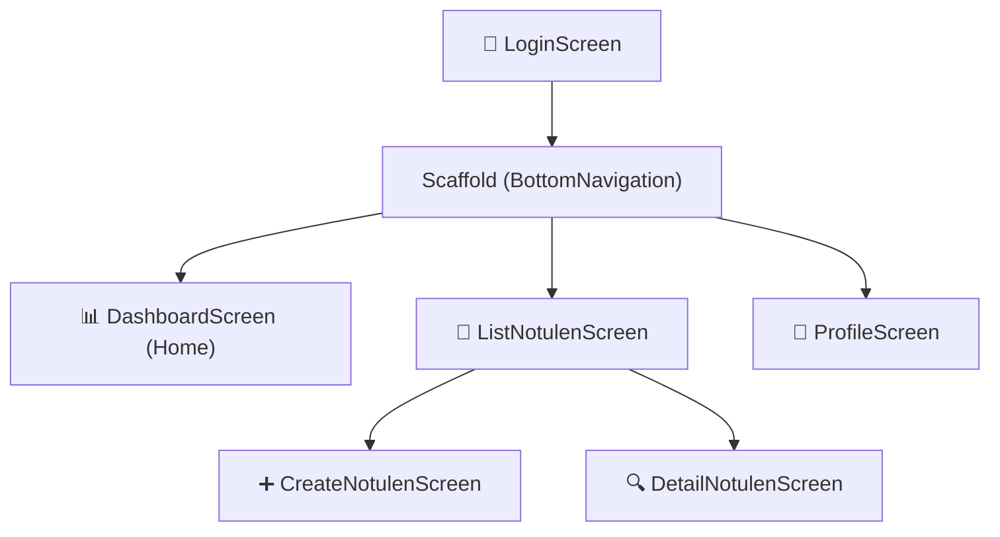

# APP_FLOW.md — Alur Aplikasi Mobile e-Notulen (Jetpack Compose)

## 📐 Sitemap Overview (Compose Navigation)
Alur aplikasi direstrukturisasi dari diagram web [cite: 2] menjadi navigasi berbasis `NavHost` untuk ekosistem Android Native:



---

## 🗂️ Route Structure (Type-Safe Navigation)
Berbeda dengan rute berbasis URL pada aplikasi Next.js [cite: 2], navigasi mobile menggunakan *Sealed Class* Kotlin untuk mendefinisikan tipe keamanan (Type-Safe) pada rute dan parameter yang melintas antar layar:

```kotlin
sealed class Screen(val route: String) {
    object Login : Screen("login")
    object Dashboard : Screen("dashboard")
    object ListNotulen : Screen("list_notulen")
    object Profile : Screen("profile")
    object CreateNotulen : Screen("create_notulen")
    data class DetailNotulen(val id: String) : Screen("detail_notulen/{id}")
}
```

---

## 🔐 Alur 1: Login & Authentication (MVVM)
Alur redirect Keycloak pada web [cite: 2] diadaptasi menjadi proses API native dengan `UiState` [cite: 3].

1. **View (`LoginScreen`):** Menampilkan input username dan password dengan `OutlinedTextField`.
2. **ViewModel (`AuthViewModel`):** Menerima event klik tombol login, memicu perubahan `UiState` menjadi `Loading`.
3. **Networking (Retrofit/Ktor):** Melakukan POST request untuk menukarkan kredensial dengan JWT token [cite: 2, 3].
4. **Hasil State:** 
   - **Sukses:** Menyimpan token ke `DataStore` atau `EncryptedSharedPreferences`, mengubah state menjadi `Success`, dan memicu navigasi ke `DashboardScreen` [cite: 2].
   - **Gagal:** Menangkap error dari Keycloak, merubah state menjadi `Error`, lalu merender pesan error via `Snackbar` [cite: 2].

---

## 📊 Alur 2: Dashboard (Scaffold & Layouts)
Tata letak dashboard web [cite: 2] disusun ulang dengan konsep Material Design 3 [cite: 5] dan layout Compose.

*   **Pondasi (Scaffold):** Membungkus layar dengan `TopAppBar` dan `BottomNavigationBar` [cite: 2].
*   **Konten (Lazy Layouts):**
    *   **Statistik:** Digambar menggunakan tata letak bersarang (`Column` & `Row`) di dalam komponen `Card` yang menampilkan ringkasan data Notulen Draft dan Final [cite: 2, 5].
    *   **Daftar Terbaru:** Memanfaatkan `LazyColumn` untuk menampilkan maksimal 5 daftar kegiatan rapat terbaru guna menjaga efisiensi rendering memori [cite: 2].

---

## 📝 Alur 3: Daftar Notulen (State Hoisting & LazyColumn)
Alur halaman daftar notulen dan pencariannya [cite: 2].

1. **Search & Filter:** Modifikasi *Search Bar* menjadi `OutlinedTextField` di atas daftar. Nilai teks ini dikelola menggunakan prinsip *State Hoisting* (diangkat ke `ViewModel`) untuk menjaga *Unidirectional Data Flow* (UDF) [cite: 1, 2].
2. **Rendering Data:** Data dari backend diumpankan ke dalam `LazyColumn`. Setiap *item* diberikan parameter `key` (menggunakan UUID notulen) agar daftar panjang tidak patah-patah saat *scroll* [cite: 1, 2, 3].
3. **Interaksi:** Mengetuk salah satu *item* akan mentransfer nilai ID-nya melalui parameter navigasi (`Screen.DetailNotulen(id)`).

---

## ✏️ Alur 4: Form Buat Notulen (Data Persistence)
Alur pembuatan dokumen metadata dari Dashboard [cite: 2].

*   **Pencegahan Data Hilang:** Penggunaan `rememberSaveable` mutlak diterapkan pada seluruh input (Judul, Tanggal, Tempat) [cite: 1, 2]. Jika perangkat diputar (orientasi berubah) atau ter-*pause* oleh sistem OS, input teks tidak akan terhapus.
*   **Proses Simpan:**
    *   View memberikan notifikasi *intent* "Simpan" ke `NotulenViewModel`.
    *   Komponen antarmuka menampilkan `CircularProgressIndicator` dan mematikan fungsi *click* pada tombol (menghindari manipulasi berlebih/ *double click*) [cite: 2].
    *   Apabila respons API berhasil, `NavController` dipanggil untuk kembali ke layar sebelumnya (`popBackStack()`) [cite: 2].

---

## ⚠️ Alur 5: Error Handling & State Lifecycle
Berdasarkan bagan `Error Handling Flow` [cite: 2], penanganan siklus data di Android diwajibkan menggunakan hierarki `UiState`:

```kotlin
sealed interface GeneralUiState<out T> {
    object Loading : GeneralUiState<Nothing>
    data class Success<T>(val data: T) : GeneralUiState<T>
    data class Error(val message: String) : GeneralUiState<Nothing>
}
```
View diwajibkan melakukan observasi (`collectAsState()`) terhadap arus data dari ViewModel. Jika token JWT kedaluwarsa (HTTP 401), mekanisme *interceptor* Retrofit akan berusaha me-*refresh* token atau secara otomatis me-reset UI ke `LoginScreen` [cite: 2, 3].
