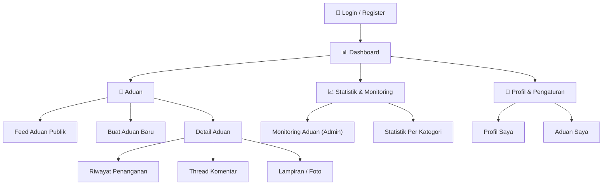

# APP_FLOW.md — Alur Aplikasi TiketBantu (Mobile Helpdesk & Pengaduan Fasilitas Kampus)

## 📐 Sitemap Overview



---

## 🗂️ Route Structure (React Native / Mobile Navigation)

```
/                           → Redirect ke /dashboard

/auth/login                 → Halaman login (User / Agen / Admin)
/auth/register              → Pendaftaran akun pelapor umum (Mahasiswa/Dosen/Civitas)
/auth/logout                → Logout & clear session

/dashboard                  → Dashboard utama (layout 2 kolom: Feed + Sidebar)
/dashboard?sort=most_liked  → Feed diurutkan berdasarkan dukungan terbanyak (default Agen)
/dashboard?status=baru      → Feed tersaring berdasarkan status
/dashboard?category=it      → Feed tersaring berdasarkan kategori

/tickets                    → Feed Aduan Publik (alias dashboard feed)
/tickets/create             → Form buat aduan baru
/tickets/[id]               → Detail aduan (read-only view + komentar + lampiran)
/tickets/mine               → Aduan Saya (aduan yang dibuat user login)

/admin/monitoring           → Pure Monitoring Dashboard (Admin only, tanpa assignment)
/admin/users                → Manajemen akun pengguna & kategori (Admin only)

/profile                    → Profil saya
```

> **Note**: Tidak ada route atau fitur `/admin/assign` — **Admin 100% monitoring & pengelolaan sistem**, tidak menugaskan agen secara manual. Agen mengambil tugas secara mandiri (claim) dari feed publik.

---

## 🔐 Alur 1: Login, Register & Authentication

```
┌─────────────────────────────────────────────────────────────────┐
│                         ALUR LOGIN                              │
└─────────────────────────────────────────────────────────────────┘

   User membuka TiketBantu
          │
          ▼
   ┌──────────────┐     Ya      ┌──────────────────────────────┐
   │ Sudah login? │────────────▶│  Dashboard (sesuai role)      │
   │ (token valid) │             │  • User   → Feed Publik       │
   └──────┬───────┘             │  • Agen   → Feed Most Liked   │
          │ Tidak               │  • Admin  → Monitoring        │
          ▼                     └──────────────────────────────┘
   ┌──────────────┐
   │  Halaman     │
   │  Login       │
   └──────┬───────┘
          │ Klik "Masuk" / "Daftar Akun Baru"
          ▼
   ┌────────────────────────────┐
   │  INPUT KREDENSIAL          │
   │                            │
   │  Email    : [____________] │
   │  Password : [____________] │
   │                            │
   │  [Login]  [Daftar Baru]    │
   └──────────┬─────────────────┘
              │
              ├── Login ──────────────────────────────┐
              │                                       │
              └── Register ──▶ Form Register ──▶ Setelah daftar, auto login
                  (Nama, Email, NIM/NIP,            atau redirect ke login
                   Password, Role default = User)
                          │
                          ▼
   ┌──────────────┐     Gagal   ┌──────────────┐
   │  Server      │────────────▶│  Error:      │
   │  Validasi    │             │  Coba lagi   │
   │  (Laravel    │             │  / Form      │
   │   Auth)      │             │  errors      │
   └──────┬───────┘             └──────────────┘
          │ Berhasil
          ▼
   ┌──────────────────────────────────────┐
   │  Token disimpan (secure storage)     │
   │                                      │
   │  Middleware Guard per role:          │
   │  ┌────────────────────────────────┐  │
   │  │ Admin (A):                     │  │
   │  │  → /admin/monitoring           │  │
   │  ├────────────────────────────────┤  │
   │  │ Agen (G):                      │  │
   │  │  → /dashboard (Most Liked)     │  │
   │  │  + bisa claim & update status  │  │
   │  ├────────────────────────────────┤  │
   │  │ User (U):                      │  │
   │  │  → /dashboard (Feed Publik)    │  │
   │  │  + bisa buat aduan & dukung    │  │
   │  └────────────────────────────────┘  │
   └──────────┬───────────────────────────┘
              │
              ▼
   ┌──────────────┐
   │  Redirect ke │
   │  Dashboard   │
   └──────────────┘
```

### Session Management

```
   ┌────────────────────────────────────────────────────┐
   │  • Token expired → auto redirect ke /auth/login     │
   │  • Middleware guard membatasi rute sesuai role      │
   │  • Logout → clear token, session & cookies          │
   │  • Profile Bar menampilkan nama, role, email,       │
   │    avatar user yang sedang login                    │
   └────────────────────────────────────────────────────┘
```

---

## 📊 Alur 2: Dashboard (Tampilan 2 Kolom)

```
┌─────────────────────────────────────────────────────────────────┐
│                 HALAMAN DASHBOARD (2 KOLOM)                     │
│                                                                 │
│  ┌────────────────────────────────────────┐  ┌───────────────┐ │
│  │  Feed Aduan Publik (Kolom Kiri)        │  │  SIDEBAR      │ │
│  │                                        │  │  (Kolom Kanan)│ │
│  │  ┌──────────────────────────────────┐  │  │               │ │
│  │  │ 🔍 [Cari aduan...______________] │  │  │  Filter:      │ │
│  │  └──────────────────────────────────┘  │  │  [Status: ▼]  │ │
│  │                                        │  │  [Kategori: ▼]│ │
│  │  ┌──────────────────────────────────┐  │  │               │ │
│  │  │ ⚡ Proyektor rusak di GK Lantai 3│  │  │  🔥 Most      │ │
│  │  │    4                           │  │  │     Liked     │ │
│  │  │ 📍 Gedung Kampus A · Lantai 3   │  │  │  [Urutkan     │ │
│  │  │ 🏷️ Teknologi & IT              │  │  │   berdasarkan │ │
│  │  │ ❤️ 128 orang mengalami          │  │  │   dukungan ▼] │ │
│  │  │ 🟡 Diproses oleh: Pak Budi (IT) │  │  │               │ │
│  │  │ [Detail] [Saya Juga Mengalami ❤️]│ │  │  Statistik:   │ │
│  │  └──────────────────────────────────┘  │  │  • Baru: 12   │ │
│  │                                        │  │  • Diproses: 8│ │
│  │  ┌──────────────────────────────────┐  │  │  • Selesai: 45│ │
│  │  │ 💧 Kebocoran AC di Lab Komputer  │  │  │  • Terdampak: │ │
│  │  │    2                           │  │  │    312 orang  │ │
│  │  │ 📍 Gedung B · Lantai 2          │  │  │               │ │
│  │  │ ❤️ 96 orang mengalami           │  │  │  Quick Action:│ │
│  │  │ 🔵 Baru · Belum di-claim        │  │  │  [➕ Buat     │ │
│  │  │ [Detail] [Saya Juga Mengalami ❤️]│ │  │   Aduan]      │ │
│  │  └──────────────────────────────────┘  │  │  [📋 Aduan    │ │
│  │                                        │  │   Saya]       │ │
│  │              ⋮ (infinite scroll)       │  │               │ │
│  │                                        │  │               │ │
│  │  ═══ BAGIAN BAWAH: ADUAN SELESAI ═══   │  │               │ │
│  │  ┌──────────────────────────────────┐  │  │               │ │
│  │  │ 💡 Lampu koridor gelap Lt. 1     │  │  │               │ │
│  │  │    ✓ Selesai  ← Badge Centang    │  │  │               │ │
│  │  │    Hijau                         │  │  │               │ │
│  │  │ ❤️ 210 orang mengalami          │  │  │               │ │
│  │  └──────────────────────────────────┘  │  │               │ │
│  └────────────────────────────────────────┘  └───────────────┘ │
│                                                                 │
└─────────────────────────────────────────────────────────────────┘
```

### Perbedaan Dashboard per Role

| Aspek                     | User (U)                        | Agen (G)                              | Admin (A)                     |
| ------------------------- | ------------------------------- | ------------------------------------- | ----------------------------- |
| Feed default              | Aduan publik terbaru            | **Aduan diurutkan Most Liked (default)** | Monitoring (bukan feed claim) |
| Kolom kiri                | Feed publik                     | Feed publik                           | Statistik & status aduan      |
| Kolom kanan               | Search, Filter, Most Liked      | Search, Filter, Most Liked            | Ringkasan monitoring          |
| Tombol aksi               | Buat Aduan, Dukung              | **Claim Tugas**, Update Status        | Hanya lihat & hapus (soft delete) |
| Penugasan                 | —                               | **Claim mandiri (linear queue)**      | ❌ Tidak ada assignment       |

> **Prinsip Linear Queue**: Agen **tidak menunggu tugas dari Admin**. Agen melihat aduan di dashboard → klik **Claim** → aduan langsung menjadi milik agen tersebut → status berubah ke `Diproses`.

---

## 🎫 Alur 3: Buat Aduan Baru

```
┌─────────────────────────────────────────────────────────────────┐
│                    ALUR BUAT ADUAN BARU                         │
└─────────────────────────────────────────────────────────────────┘

   Klik "➕ Buat Aduan" (Quick Action / FAB)
          │
          ▼
   ┌──────────────────────────────────────────────────────┐
   │              FORM ADUAN BARU (100% PUBLIK)            │
   │                                                       │
   │  Judul Aduan *      : [____________________________] │
   │  Kategori *         : [Teknologi & IT ▼]             │
   │                        Fasilitas Ruangan              │
   │                        Infrastruktur Umum             │
   │  Lokasi *           :                                   │
   │    Gedung  : [____________________________]           │
   │    Lantai  : [____________________________]           │
   │    Ruangan : [____________________________]           │
   │  Deskripsi Masalah* : [____________________________] │
   │                       [____________________________] │
   │                                                       │
   │  📎 Lampiran (opsional, max 5MB/file):                │
   │     [📷 Ambil Foto]  [📁 Pilih File]                  │
   │     Format: JPG, PNG, PDF, DOCX, ZIP, TXT             │
   │     ✓ foto_ac.jpg (1.2MB)  [🗑️]                      │
   │                                                       │
   │  ⚠️ Semua aduan bersifat PUBLIK dan dapat            │
   │     dilihat seluruh civitas akademika                 │
   │                                                       │
   │            [Batal]  [Kirim Aduan →]                   │
   └──────────────────────────────────────────────────────┘
          │
          │ Validasi server (mime types + max 5MB)
          ▼
   ┌──────────────┐     Gagal    ┌──────────────┐
   │  Simpan ke   │─────────────▶│ Tampilkan    │
   │  Database    │              │ error field  │
   │  (MySQL)     │              │ + toast ❌   │
   │  status=Baru │              └──────────────┘
   └──────┬───────┘
          │ Berhasil
          ▼
   ┌──────────────────────────────────┐
   │  Toast ✅ "Aduan berhasil dibuat" │
   │  Counter dukungan = 0 (otomatis   │
   │  pelapor tercatat terdampak)      │
   │  Redirect → Detail Aduan          │
   └──────────────────────────────────┘
```

### Aturan Metadata Aduan

| Aturan                        | Keterangan                                                              |
| ----------------------------- | ----------------------------------------------------------------------- |
| Prioritas Low/Med/High        | ❌ **DIHAPUS** — urgensi ditentukan otomatis dari akumulasi dukungan (Most Liked) |
| Visibilitas                   | 100% Publik — semua civitas bisa melihat                                |
| Edit                          | Hanya saat status = `Baru`, hanya judul & deskripsi                     |
| Kunci                         | Status `Selesai` / `Ditutup` → terkunci dari pengeditan                 |
| Agregasi duplikat             | User diarahkan memberi dukungan pada aduan serupa, bukan membuat tiket baru |

---

## 🙋 Alur 4: Claim Tugas oleh Agen (Linear Queue)

```
┌─────────────────────────────────────────────────────────────────┐
│              ALUR CLAIM TUGAS (AGEN, TANPA ADMIN)               │
└─────────────────────────────────────────────────────────────────┘

   Agen membuka Dashboard (default urutan Most Liked)
          │
          ▼
   ┌──────────────────────────────────────────┐
   │  ⚡ Proyektor rusak di GK Lantai 3       │
   │  ❤️ 128 orang · 🔵 Baru · Belum di-claim │
   │                                          │
   │     [Detail]  [🖐️ Claim Tugas]           │
   └──────────────────┬───────────────────────┘
                      │ Klik "Claim Tugas"
                      ▼
   ┌──────────────┐   Validasi: apakah masih
   │  Server lock │   status "Baru" & belum ada
   │  aduan       │   agen lain yg claim?
   └──────┬───────┘
          │
          ├── Sudah di-claim agen lain ──▶ Toast: "Aduan sudah diambil agen lain"
          │                                   Feed auto-refresh
          │
          └── Berhasil
                │
                ▼
   ┌──────────────────────────────────┐
   │  • tickets.agent_id = agen login  │
   │  • status: Baru → Diproses        │
   │  • Toast ✅ "Tugas berhasil       │
   │    di-claim"                      │
   │  • Feed update realtime           │
   └──────────────────────────────────┘
```

> **Linear Queue**: Satu aduan = satu agen. Alur penanganan linier: `Baru → Diproses → Selesai / Ditutup`. Tidak ada mekanisme assign manual oleh Admin di manapun.

---

## 🔄 Alur 5: Pembaruan Status Penanganan

```
┌─────────────────────────────────────────────────────────────────┐
│                ALUR UPDATE STATUS (AGEN/ADMIN)                  │
└─────────────────────────────────────────────────────────────────┘

   Dari Detail Aduan (oleh agen yang meng-claim / admin)
          │
          ▼
   ┌────────────────────────────────────────────┐
   │  Status saat ini: 🟡 Diproses               │
   │                                             │
   │  Ubah Status: [Diproses ▼]                  │
   │                 Selesai                     │
   │                 Ditutup                     │
   │                                             │
   │  [Catatan Penanganan / Komentar] (opsional) │
   │  [Simpan Status]                            │
   └──────────────────┬─────────────────────────┘
                      │
          ┌───────────┼───────────┐
          ▼                       ▼
   ┌──────────────┐      ┌──────────────────────────┐
   │  → Selesai   │      │  → Ditutup               │
   │              │      │                          │
   │ • Badge ✓    │      │ • Tiket terkunci         │
   │   Centang    │      │ • Masuk bagian bawah     │
   │   Hijau      │      │   feed                   │
   │ • Aduan      │      │ • Terkunci dari edit     │
   │   pindah ke  │      │   & komentar lanjutan    │
   │   bagian     │      │                          │
   │   bawah feed │      │                          │
   │ • Email ke   │      │                          │
   │   pelapor    │      │                          │
   └──────────────┘      └──────────────────────────┘
```

### Notulen Status Lifecycle (Tiket)

```
   ┌─────────┐         ┌──────────┐
   │  Baru   │────────▶│ Diproses │◀────── claim oleh Agen
   └────┬────┘         └────┬─────┘
        │                   │
        │ Ditutup (Admin)   ├── Selesai ──▶ 🔒 terkunci
        ▼                   │                ✓ badge hijau
   ┌─────────┐              │                pindah ke bawah feed
   │Ditutup  │              │
   │ 🔒      │              └── Ditutup (G/A) ──▶ 🔒
   └─────────┘
```

### Aturan Penguncian

```
   ┌────────────────────────────────────────────────────────┐
   │  Status Selesai / Ditutup:                             │
   │  • ❌ Tidak bisa edit judul/deskripsi                  │
   │  • ❌ Tidak bisa ubah status lagi                      │
   │  • ❌ Tidak bisa komentar lanjutan (read-only)         │
   │  • ❌ Tombol "Saya Juga Mengalami" tetap aktif         │
   │    (dukungan tetap bisa bertambah sebagai data urgensi)│
   └────────────────────────────────────────────────────────┘
```

---

## ❤️ Alur 6: Dukungan "Saya Juga Mengalami" (Most Liked)

```
┌─────────────────────────────────────────────────────────────────┐
│              ALUR DUKUNGAN & AGREGASI MOST LIKED                │
└─────────────────────────────────────────────────────────────────┘

   User melihat aduan yang sama dengan masalahnya
          │
          ▼
   ┌──────────────────────────────────────┐
   │  ❤️ 128 orang mengalami masalah ini  │
   │                                      │
   │     [❤️ Saya Juga Mengalami]          │
   └──────────────────┬───────────────────┘
                      │ Klik (satu kali per user)
                      ▼
   ┌──────────────┐   Sudah pernah dukung?
   │  Cek di      │────────▶ Toggle off / ignore
   │  ticket_     │   (1 user = 1 dukungan)
   │  supports    │
   └──────┬───────┘
          │ Baru
          ▼
   ┌──────────────────────────────────────┐
   │  • INSERT ticket_supports             │
   │  • Counter real-time +1               │
   │  • Toast ✅ "Dukungan tercatat"       │
   │  • Posisi aduan bisa naik di feed     │
   │    (jika sort = Most Liked)           │
   └──────────────────────────────────────┘
```

### Manfaat Most Liked

```
   ┌──────────────────────────────────────────────────────────┐
   │  • Urgensi OTOMATIS — tanpa field prioritas manual       │
   │  • Agregasi duplikat — user cukup dukung, bukan bikin    │
   │    tiket baru                                            │
   │  • Sorting default dashboard AGEN = dukungan terbanyak   │
   │  • Counter "pengguna terdampak" = metrik dampak fasilitas│
   └──────────────────────────────────────────────────────────┘
```

---

## 💬 Alur 7: Thread Komentar (Realtime)

```
┌─────────────────────────────────────────────────────────────────┐
│                 HALAMAN DETAIL ADUAN + KOMENTAR                 │
│                                                                 │
│  ◀ Kembali    ⚡ Proyektor rusak di GK Lantai 3    🟡 Diproses  │
│                                                                 │
│  📍 Gedung Kampus A · Lantai 3 · Ruang 301                      │
│  🏷️ Teknologi & IT  · 👤 Dilaporkan oleh: Andi (Mahasiswa)      │
│  ❤️ 128 orang mengalami   [❤️ Saya Juga Mengalami]              │
│                                                                 │
│  ┌─ Deskripsi ──────────────────────────────────────────────┐  │
│  │ Proyektor tidak menyala sejak Senin, sudah coba         │  │
│  │ ganti kabel tetap tidak bisa...                          │  │
│  └──────────────────────────────────────────────────────────┘  │
│                                                                 │
│  ┌─ Lampiran ──────────────────────────────────────────────┐  │
│  │ [🖼️ foto_ac.jpg] [🖼️ foto2.jpg] [📄 nota.pdf]          │  │
│  └──────────────────────────────────────────────────────────┘  │
│                                                                 │
│  ┌─ Riwayat Penanganan ────────────────────────────────────┐  │
│  │ 🟢 13 Sep 09:00 · Dibuat oleh Andi                     │  │
│  │ 🟡 13 Sep 10:15 · Di-claim oleh Pak Budi (Agen IT)     │  │
│  │ 🟡 13 Sep 13:40 · Komentar agen: "Unit pengganti       │  │
│  │                   sedang diambil dari gudang"            │  │
│  └──────────────────────────────────────────────────────────┘  │
│                                                                 │
│  ┌─ 💬 Komentar (Livewire/Realtime Polling) ────────────────┐  │
│  │ 👤 Andi    : Kak, sudah dicek belum?                    │  │
│  │ 🛠️ Pak Budi: Sudah, proyektornya perlu diganti unit    │  │
│  │ 👤 Andi    : Oh iya, terima kasih kak!                  │  │
│  │                                                         │  │
│  │ [Tulis komentar...____________________]  [Kirim]        │  │
│  └──────────────────────────────────────────────────────────┘  │
│                                                                 │
└─────────────────────────────────────────────────────────────────┘
```

```
   User mengetik komentar → Kirim
          │
          ▼
   ┌─────────────────────────────────────────────┐
   │  Polling engine (Livewire)                  │
   │  • Komentar langsung muncul TANPA reload    │
   │  • Counter dukungan update real-time        │
   │  • Toast ✅ "Komentar terkirim"             │
   │  • Agen bisa menulis "Catatan Penanganan"   │
   │    sebagai komentar ber-label khusus        │
   └─────────────────────────────────────────────┘
```

---

## 🔍 Alur 8: Search, Filter & Infinite Scroll

```
┌─────────────────────────────────────────────────────────────────┐
│              ALUR PENCARIAN & FILTER FEED                       │
└─────────────────────────────────────────────────────────────────┘

   SIDEBAR (Kolom Kanan)
   ┌──────────────────────────────────────┐
   │ 🔍 [Cari aduan...___________]        │──▶ Filter judul & deskripsi
   │                                      │    (LIKE search di query)
   │ Filter Status: [Semua ▼]             │──▶ Baru / Diproses / Selesai / Ditutup
   │ Filter Kategori: [Semua ▼]           │──▶ IT / Ruangan / Umum
   │                                      │
   │ 🔥 Sort: [Terbaru ▼]                 │──▶ Terbaru / Most Liked
   │                                      │
   │ [Terapkan Filter]  [Reset]           │
   └──────────────────────────────────────┘
          │
          ▼
   ┌────────────────────────────────────────────────────┐
   │  LOGIKA URUTAN FEED (selalu aktif):                │
   │                                                    │
   │  1. Aduan aktif (Baru & Diproses) di bagian atas   │
   │     → sort sesuai pilihan: Terbaru ATAU Most Liked │
   │  2. Aduan Selesai SELALU di bagian paling bawah    │
   │     → dengan Badge Centang Hijau ✓ Selesai         │
   │  3. Aduan Ditutup juga di bagian bawah (locked)    │
   └────────────────────────────────────────────────────┘
          │
          ▼
   ┌────────────────────────────────────────────────────┐
   │              INFINITE SCROLL                       │
   │                                                    │
   │  User scroll ke bawah                              │
   │        │                                           │
   │        ▼                                           │
   │  ┌──────────────┐                                  │
   │  │ Threshold    │  Mendekati item terakhir         │
   │  │ tercapai     │  (offset + limit pagination)     │
   │  └──────┬───────┘                                  │
   │         │                                          │
   │         ▼                                          │
   │  ┌──────────────┐     Loading spinner "Memuat..."  │
   │  │ Fetch next   │                                  │
   │  │ page (API)   │                                  │
   │  └──────┬───────┘                                  │
   │         │                                          │
   │    ┌────┴────┐                                     │
   │    ▼         ▼                                     │
   │  Ada data  Data habis                              │
   │    │         │                                     │
   │    ▼         ▼                                     │
   │  Render    Tampilkan "✅ Semua aduan               │
   │  items        telah dimuat"                        │
   │            (scroll berhenti)                       │
   └────────────────────────────────────────────────────┘
```

### Data Filtering (API Query)

```
   API GET /tickets?search=proyektor&status=baru&category=it&sort=most_liked&page=2
          │
          ▼
   ┌────────────────────────────────────────────────────────┐
   │  WHERE deleted_at IS NULL                              │
   │  AND (title LIKE %q% OR description LIKE %q%)          │
   │  AND (status = :status jika ada)                       │
   │  AND (category_id = :cat jika ada)                     │
   │  ORDER BY:                                             │
   │    • most_liked → (SELECT COUNT(*) FROM ticket_supports)│
   │      DESC, created_at DESC                             │
   │    • terbaru    → created_at DESC                      │
   │  ── Lalu pisah: Selesai/Ditutup selalu pindah          │
   │     ke blok bawah (client-side atau query union)       │
   └────────────────────────────────────────────────────────┘
```

---

## 📈 Alur 9: Monitoring Admin (Pure Monitoring)

```
┌─────────────────────────────────────────────────────────────────┐
│              HALAMAN MONITORING (ADMIN ONLY)                    │
│                                                                 │
│  ⚠️ Mode monitoring saja — tanpa fitur assignment agen          │
│                                                                 │
│  ┌─────────────┐ ┌─────────────┐ ┌─────────────┐ ┌───────────┐ │
│  │ 🆕 Aduan    │ │ 🟡 Diproses │ │ ✓ Selesai   │ │ 👥 Total  │ │
│  │    Baru     │ │             │ │             │ │ Terdampak │ │
│  │    12       │ │     8       │ │    45       │ │   312     │ │
│  └─────────────┘ └─────────────┘ └─────────────┘ └───────────┘ │
│                                                                 │
│  ┌─ Distribusi Per Kategori ──────────────────────────────┐    │
│  │  Teknologi & IT       ██████████████████  42          │    │
│  │  Fasilitas Ruangan    ████████████        30          │    │
│  │  Infrastruktur Umum   ███████           18            │    │
│  └────────────────────────────────────────────────────────┘    │
│                                                                 │
│  ┌─ Distribusi Per Lokasi ────────────────────────────────┐    │
│  │  Gedung A ████████ 20 │ Gedung B █████ 12              │    │
│  │  Gedung C ████ 8      │ Lainnya ██ 4                   │    │
│  └────────────────────────────────────────────────────────┘    │
│                                                                 │
│  ┌─ Aksi yang TERSEDIA untuk Admin ───────────────────────┐    │
│  │  ✏️ Manajemen Akun (buat/edit nonaktifkan User/Agen)   │    │
│  │  🏷️ Manajemen Kategori                                  │    │
│  │  🗑️ Hapus Aduan (soft delete → trash)                  │    │
│  │  ♻️ Restore dari trash                                  │    │
│  │                                                         │    │
│  │  ❌ TIDAK ADA: penugasan agen, ubah prioritas manual    │    │
│  └─────────────────────────────────────────────────────────┘    │
│                                                                 │
└─────────────────────────────────────────────────────────────────┘
```

### Batasan Admin (Sesuai Spesifikasi)

| Admin BOLEH                          | Admin TIDAK BOLEH                     |
| ------------------------------------ | ------------------------------------- |
| Monitoring total & status aduan      | ❌ Assign / menugaskan agen            |
| Lihat statistik per kategori & lokasi| ❌ Mengubah urutan claim agen          |
| Manajemen akun & kategori            | ❌ Override hasil claim agen           |
| Soft delete aduan duplikat/spam      | ❌ Mengedit isi aduan pelapor          |
| Restore aduan dari trash             | ❌ Menetapkan prioritas manual         |

---

## 🔔 Alur 10: Notifikasi

```
   ┌──────────────────────────────────────────────────────────┐
   │                                                          │
   │  📧 Email (P0):                                          │
   │  • Status aduan berubah → email otomatis ke Pelapor      │
   │  • (Baru→Diproses→Selesai/Ditutup)                       │
   │                                                          │
   │  🍞 Toast UI (P0):                                       │
   │  • ✅ Claim tiket berhasil                               │
   │  • ✅ Status diperbarui                                  │
   │  • ✅ Komentar terkirim                                  │
   │  • ✅ Aduan berhasil dibuat                              │
   │  • ❌ Gagal upload / validasi                            │
   │                                                          │
   │  📱 Push Notification (P2 — roadmap mobile):             │
   │  • Status aduan berubah                                  │
   │  • Komentar baru di aduan saya                           │
   └──────────────────────────────────────────────────────────┘
```

---

## 🖥️ Layout Utama (Mobile)

```
┌───────────────────────────────────┐
│  🎫 TiketBantu        🔔 👤      │  ← Header: logo, notif, profile bar
│  ─────────────────────────────────│     (nama, role, email, avatar)
│  ┌──────┐ ┌──────────────────────┐│
│  │ Feed │ │  🔍 Search Bar       ││  ← Dua kolom (tablet/foldable)
│  │      │ │  Filter Status ▼     ││     Pada HP: kolom kanan jadi
│  │ Ad-  │ │  Filter Kategori ▼   ││     bottom sheet / drawer
│  │ uan  │ │  🔥 Most Liked sort  ││
│  │ List │ │  ────────────────    ││
│  │ (in- │ │  📊 Statistik ringkas││
│  │ fini-│ │  ➕ Buat Aduan       ││
│  │ te)  │ │  📋 Aduan Saya       ││
│  └──────┘ └──────────────────────┘│
│  ─────────────────────────────────│
│  🏠 Feed   ➕ Buat   📊 (A)  👤  │  ← Bottom Navigation
└───────────────────────────────────┘
```

### Bottom Navigation per Role

| Menu Item       | User | Agen | Admin |
| --------------- | ---- | ---- | ----- |
| 🏠 Feed Aduan   | ✅    | ✅    | ✅     |
| ➕ Buat Aduan   | ✅    | ❌    | ✅     |
| 📊 Monitoring   | ❌    | ❌    | ✅     |
| 👤 Profil       | ✅    | ✅    | ✅     |

---

## ⚠️ Error Handling Flow (Mobile App)

```
   API Call
      │
      ├── 200 OK ────────────▶ Render data
      │
      ├── 401 Unauthorized ──▶ Clear token → Redirect ke login
      │
      ├── 403 Forbidden ─────▶ "Akses Ditolak" (role tidak sesuai)
      │
      ├── 404 Not Found ─────▶ "Aduan tidak ditemukan / sudah dihapus"
      │
      ├── 422 Validation ────▶ Error di field form (judul, lokasi, file > 5MB, dll)
      │
      ├── 500 Server Error ──▶ "Terjadi Kesalahan" + Toast + Retry
      │
      └── Network Error ─────▶ "Tidak dapat terhubung" + [Coba Lagi]
```

---

## 🗄️ State Flow: Tiket Lifecycle

```
                    ┌────────┐
        User buat ─▶│  Baru  │──────────────┐
                    └───┬────┘              │
                        │                   │ Edit judul/deskripsi
                        │                   │ (pelapor, saat Baru saja)
                        │                   ▼
                        │              ┌────────┐
                        │              │  Baru  │ (ter-edit)
                        │              └───┬────┘
                        │ Agen claim       │
                        ▼                  │
                   ┌─────────┐             │
                   │ Diproses │◀────────────┘
                   └───┬─────┘
                       │
           ┌───────────┼───────────┐
           ▼                       ▼
      ┌─────────┐            ┌──────────┐
      │ Selesai │            │ Ditutup  │
      │ ✓ Hijau │            │ 🔒       │
      │ 🔒      │            │          │
      └───┬─────┘            └────┬─────┘
          │                       │
          │ Admin soft delete     │ Admin soft delete
          ▼                       ▼
      ┌───────────────────────────────┐
      │         TRASH (deleted_at)     │
      └───────┬───────────────┬───────┘
              │               │
              ▼               ▼
        ┌──────────┐   ┌──────────────┐
        │ Restore  │   │ Permanent    │
        │ (→Draft) │   │ Delete       │
        └──────────┘   │ (by Admin)   │
                       └──────────────┘
```

---

## 📌 Ringkasan Prinsip Utama (sesuai catatan)

| # | Prinsip                                   | Implementasi di Flow |
| - | ----------------------------------------- | -------------------- |
| 1 | Admin hanya monitoring                    | Tidak ada route/aksi assignment; monitoring + soft delete + manajemen master data |
| 2 | Agen claim langsung (linear queue)        | Alur 4: claim mandiri dari feed, `Baru → Diproses` otomatis, first-come-first-served |
| 3 | User lihat semua, filter search & most liked | Alur 8: search bar, filter status/kategori, sort Most Liked |
| 4 | Prioritas manual dihapus                  | Urgensi = counter `ticket_supports` (Most Liked) |
| 5 | Tampilan 2 kolom                          | Layout utama: feed (kiri) + sidebar search/filter/statistik (kanan) |
| 6 | Selesai di bawah + badge centang hijau    | Logika urutan feed + Badge `✓ Selesai` hijau di blok bawah |
| 7 | Infinite scroll sampai habis              | Alur 8: offset/limit pagination hingga "semua aduan telah dimuat" |
| 8 | Dashboard Agen default Most Liked         | `sort=most_liked` sebagai default untuk role Agen |

---

*Dokumen ini merupakan blueprint alur aplikasi TiketBantu (Mobile) — Phase 1 Web Helpdesk Core MVP. Phase 2: REST API adapter, kamera & GPS lokasi, push notification.*
