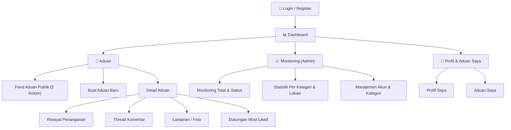

# APP_FLOW.md — Alur Aplikasi TiketBantu (Native Android — Jetpack Compose)

> **Stack**: Native Android (Kotlin) + Jetpack Compose, REST API (Retrofit), Backend API + MySQL.
> **Catatan**: Aplikasi **tidak menggunakan Laravel/Livewire sama sekali** — seluruh realtime & data
> di-handle via Retrofit (REST API) dengan pola polling + Coroutines. Prinsip alur mengikuti
> catatan inti: *Admin hanya monitoring, Agen claim linear, User melihat semua (search + Most Liked),
* prioritas manual dihapus, tampilan dua kolom, aduan Selesai di bawah dengan badge centang hijau,
> infinite scroll sampai habis, dashboard Agen default Most Liked.*

---

## 📐 Sitemap Overview



---

## 🗂️ Route Structure (Navigation Compose — Type-Safe)

```kotlin
// === Nested Graph: Auth ===
Login                       → Halaman login (User / Agen / Admin)
Register                    → Pendaftaran akun pelapor (role default = User)

// === Nested Graph: Main (Scaffold + BottomNavigation) ===
Dashboard                   → Feed aduan publik, layout 2 kolom
                              (default Agen: sort = most_liked)
CreateTicket                → Form buat aduan baru (FAB / quick action)
TicketDetail/{id}           → Detail aduan (read-only + komentar + lampiran)
MyTickets                   → Aduan Saya (hanya aduan milik user login)
Profile                     → Profil & logout

// === Nested Graph: Admin ===
Monitoring                  → Pure Monitoring Dashboard (Admin only)
UserManagement              → Manajemen akun & kategori (Admin only)
```

```kotlin
@Serializable object Login
@Serializable object Register
@Serializable object Dashboard
@Serializable object CreateTicket
@Serializable data class TicketDetail(val id: Int)   // type-safe arg
@Serializable object MyTickets
@Serializable object Profile
@Serializable object Monitoring                       // Admin only
@Serializable object UserManagement                   // Admin only
```

> **Note**: Tidak ada route `AssignTicket` / route penugasan agen manapun —
> **Admin 100% monitoring & pengelolaan sistem**, tidak menugaskan agen secara manual.

---

## 🔐 Alur 1: Login, Register & Session (Auth)

```
┌─────────────────────────────────────────────────────────────────┐
│                         ALUR LOGIN                              │
└─────────────────────────────────────────────────────────────────┘

   User membuka TiketBantu
          │
          ▼
   ┌──────────────┐     Ya      ┌──────────────────────────────┐
   │ Token masih  │────────────▶│  Dashboard (sesuai role)      │
   │ valid?       │  (splash)   │  • User   → Feed Publik       │
   │(DataStore)   │             │  • Agen   → Feed Most Liked   │
   └──────┬───────┘             │  • Admin  → Monitoring        │
          │ Tidak/expire        └──────────────────────────────┘
          ▼
   ┌────────────────────────────┐
   │  LOGIN SCREEN (Compose)    │
   │                            │
   │  Email    : [OutlinedText] │
   │  Password : [OutlinedText] │
   │                            │
   │  [Masuk]   [Daftar Akun]   │
   └──────────┬─────────────────┘
              │
              ├── "Daftar Akun" ──▶ REGISTER SCREEN
              │     (Nama, Email, NIM/NIP, Password)
              │     → success → auto redirect Login
              │
              ▼  Klik "Masuk"
   ┌──────────────────────────────────────┐
   │  POST /api/login  (Retrofit)         │
   │  Response: { token, user, role }     │
   └──────┬───────────────────────────────┘
          │
     ┌────┴────┐
     ▼         ▼
  Berhasil   Gagal/401/422
     │         │
     ▼         ▼
┌─────────┐  ┌──────────────────────────────┐
│ Simpan  │  │ UiState.Error                │
│ token ke│  │ → snackbar "Email/password   │
│DataStore│  │   salah" / error per-field   │
│(Session)│  └──────────────────────────────┘
└────┬────┘
     │
     ▼
┌──────────────────────────────────────┐
│  NavController.navigate(Dashboard)   │
│  sesuai role default:                │
│  • User   → Feed (terbaru)           │
│  • Agen   → Feed (MOST LIKED default)│
│  • Admin  → Monitoring               │
└──────────────────────────────────────┘
```

### Session Management (Compose)

```
   ┌──────────────────────────────────────────────────────────┐
   │  • Token disimpan di DataStore Preferences                │
   │  • OkHttp Interceptor melampirkan "Authorization: Bearer" │
   │    ke setiap request Retrofit                             │
   │  • Response 401 → interceptor clear token →               │
   │    navController.navigate(Login) { popUpTo(0) }           │
   │  • Middleware guard berbasis role di setiap destination   │
   │    (Admin route tidak muncul di BottomNav non-admin)      │
   │  • Logout → hapus token DataStore + clear back stack      │
   │  • Profile Bar (TopAppBar): nama, role, avatar user login │
   └──────────────────────────────────────────────────────────┘
```

---

## 📊 Alur 2: Dashboard (Layout 2 Kolom)

```
┌─────────────────────────────────────────────────────────────────┐
│                 HALAMAN DASHBOARD (2 KOLOM)                     │
│                                                                 │
│  ┌────────────────────────────────────────┐  ┌───────────────┐ │
│  │  Feed Aduan Publik (Kolom Kiri)        │  │  SIDEBAR      │ │
│  │                                        │  │  (Kolom Kanan)│ │
│  │  ┌──────────────────────────────────┐  │  │               │ │
│  │  │ 🔍 [SearchBar aduan..._________] │  │  │ Filter Status:│ │
│  │  └──────────────────────────────────┘  │  │ [Semua ▼]     │ │
│  │                                        │  │               │ │
│  │  ┌─ Card ─────────────────────────┐   │  │ Filter Kategori│ │
│  │  │ ⚡ Proyektor rusak GK Lt.3     │   │  │ [Semua ▼]     │ │
│  │  │ 📍 Gd. A · L3 · R.301         │   │  │               │ │
│  │  │ 🏷 Teknologi & IT             │   │  │ 🔥 Sort:      │ │
│  │  │ ❤ 128 orang terdampak         │   │  │ [Most Liked ▼]│ │
│  │  │ 🟡 Diproses — Pak Budi (IT)   │   │  │  (default Agen)│ │
│  │  │ [Detail]  [❤ Saya Juga]        │   │  │               │ │
│  │  └────────────────────────────────┘   │  │ Statistik:    │ │
│  │                                        │  │ • Baru: 12    │ │
│  │  ┌─ Card ─────────────────────────┐   │  │ • Diproses: 8 │ │
│  │  │ 💧 AC bocor Lab Komputer      │   │  │ • Selesai: 45 │ │
│  │  │ 🔵 Baru · belum di-claim      │   │  │ • Terdampak:  │ │
│  │  │ [Detail]  [🖐 Claim Tugas ←AGEN│   │  │   312         │ │
│  │  └────────────────────────────────┘   │  │               │ │
│  │                                        │  │ Quick Action: │ │
│  │              ⋮ LazyColumn               │  │ [➕ Buat Aduan]│ │
│  │         (infinite scroll)              │  │ [📋 Aduan Saya]│ │
│  │                                        │  │               │ │
│  │  ══ BAGIAN BAWAH: ADUAN SELESAI ══     │  │               │ │
│  │  ┌─ Card ─────────────────────────┐   │  │               │ │
│  │  │ 💡 Lampu koridor gelap Lt.1    │   │  │               │ │
│  │  │ ✅ ✓ Selesai  ← Badge Centang  │   │  │               │ │
│  │  │    Hijau (M3 AssistChip/Badge) │   │  │               │ │
│  │  │ ❤ 210 orang terdampak          │   │  │               │ │
│  │  └────────────────────────────────┘   │  │               │ │
│  └────────────────────────────────────────┘  └───────────────┘ │
│                                                                 │
└─────────────────────────────────────────────────────────────────┘
```

### Implementasi 2 Kolom di Compose

```kotlin
Row(Modifier.fillMaxSize()) {
    // Kolom kiri: feed (selalu tampil)
    FeedColumn(Modifier.weight(1f))                 // LazyColumn

    // Kolom kanan: sidebar — hanya di layar lebar (tablet/foldable)
    if (windowSizeClass.widthSizeClass >= WidthSizeClass.Medium) {
        SidebarColumn(Modifier.width(300.dp))       // filter, sort, statistik
    }
}
// Di HP (compact): sidebar menjadi ModalNavigationDrawer / BottomSheet
// yang dibuka lewat ikon filter di SearchBar.
```

### Perbedaan Dashboard per Role

| Aspek                | User (U)                     | Agen (G)                                  | Admin (A)                          |
| -------------------- | ---------------------------- | ----------------------------------------- | ---------------------------------- |
| Feed default         | Aduan publik **terbaru**     | **Most Liked (default)**                  | Monitoring (bukan feed claim)      |
| Kolom kiri           | Feed publik                  | Feed publik                               | Statistik & status aduan           |
| Kolom kanan          | Search, Filter, Most Liked   | Search, Filter, Most Liked                | Ringkasan monitoring               |
| Tombol aksi          | Buat Aduan, Dukung           | **Claim Tugas**, Update Status            | Lihat & hapus (soft delete)        |
| Penugasan            | —                            | **Claim mandiri (linear queue)**          | ❌ Tidak ada assignment            |

> **Prinsip Linear Queue**: Agen **tidak menunggu tugas dari Admin**. Agen melihat aduan di
> dashboard → klik **Claim** → aduan langsung menjadi milik agen → status berubah `Baru → Diproses`.

---

## 🎫 Alur 3: Buat Aduan Baru

```
┌─────────────────────────────────────────────────────────────────┐
│                    ALUR BUAT ADUAN BARU                         │
└─────────────────────────────────────────────────────────────────┘

   Klik "➕ Buat Aduan" (Quick Action di Sidebar / FAB)
          │
          ▼
   ┌──────────────────────────────────────────────────────┐
   │              FORM ADUAN BARU (100% PUBLIK)            │
   │                                                       │
   │  Judul Aduan *      : [OutlinedTextField____________] │
   │  Kategori *         : [ExposedDropdownMenuBox: ▼]    │
   │                         • Teknologi & IT              │
   │                         • Fasilitas Ruangan           │
   │                         • Infrastruktur Umum          │
   │  Lokasi *           :                                   │
   │    Gedung  : [OutlinedTextField____________________] │
   │    Lantai  : [OutlinedTextField____________________] │
   │    Ruangan : [OutlinedTextField____________________] │
   │  Deskripsi *        : [OutlinedTextField multiline__] │
   │                                                       │
   │  📎 Lampiran (opsional, max 5MB/file):                │
   │     [📷 Photo Picker] / [📁 File Picker]              │
   │     Format: JPG, PNG, PDF, DOCX, ZIP, TXT             │
   │     ✓ foto_ac.jpg (1.2 MB)  [🗑 Hapus]               │
   │                                                       │
   │  ⚠️ HelperText: "Semua aduan bersifat PUBLIK"        │
   │                                                       │
   │            [Batal]  [Kirim Aduan →]                   │
   └──────────────────────────────────────────────────────┘
          │
          │ POST /api/tickets (Retrofit, @Multipart utk file)
          ▼
   ┌──────────────┐     422 Gagal    ┌─────────────────────────┐
   │  Simpan via  │─────────────────▶│ UiState.Error → error    │
   │  Repository  │  (validasi mime  │ tampil di tiap field     │
   │  → API       │   + max 5MB)     │ (judul, lokasi, file) +  │
   │  status=Baru │                  │ snackbar ❌              │
   └──────┬───────┘                  └─────────────────────────┘
          │ 201 Berhasil
          ▼
   ┌──────────────────────────────────────┐
   │  Snackbar ✅ "Aduan berhasil dibuat"  │
   │  Counter dukungan = 0 (pelapor         │
   │  otomatis tercatat terdampak)          │
   │  navController.navigate(               │
   │      TicketDetail(newId))              │
   └──────────────────────────────────────┘
```

### Aturan Metadata Aduan

| Aturan                    | Keterangan                                                                 |
| ------------------------- | -------------------------------------------------------------------------- |
| Prioritas Low/Med/High    | ❌ **DIHAPUS** — urgensi otomatis dari akumulasi dukungan (Most Liked)      |
| Visibilitas               | 100% Publik — semua civitas bisa melihat                                    |
| Edit                      | Hanya saat status = `Baru`, hanya judul & deskripsi                         |
| Kunci                     | Status `Selesai` / `Ditutup` → terkunci dari pengeditan                     |
| Agregasi duplikat         | User diarahkan memberi dukungan pada aduan serupa, bukan membuat tiket baru |

---

## 🖐️ Alur 4: Claim Tugas oleh Agen (Linear Queue)

```
┌─────────────────────────────────────────────────────────────────┐
│              ALUR CLAIM TUGAS (AGEN — TANPA ADMIN)              │
└─────────────────────────────────────────────────────────────────┘

   Agen membuka Dashboard (default urutan = Most Liked)
          │
          ▼
   ┌──────────────────────────────────────────┐
   │  ⚡ Proyektor rusak di GK Lantai 3       │
   │  ❤ 128 orang · 🔵 Baru · belum di-claim  │
   │                                          │
   │     [Detail]   [🖐 Claim Tugas]           │
   └──────────────────┬───────────────────────┘
                      │ Klik "Claim Tugas"
                      ▼
   ┌─────────────────────────────────────────┐
   │ POST /api/tickets/{id}/claim (Retrofit) │
   │ Server lock: status "Baru" & agent null?│
   └──────┬──────────────────────────────────┘
          │
     ┌────┴───────────────────────────┐
     ▼                                ▼
  Berhasil (200)               Sudah di-claim agen lain (409)
     │                                │
     ▼                                ▼
┌───────────────────────┐   ┌────────────────────────────────┐
│ • agent_id = agen     │   │ Snackbar: "Aduan sudah diambil │
│   login               │   │ agen lain"                     │
│ • status Baru→Diproses│   │ Feed auto-refresh (re-fetch)   │
│ • Snackbar ✅          │   └────────────────────────────────┘
│ • Card update: 🟡      │
│   Diproses — saya      │
└───────────────────────┘
```

> **Linear Queue**: Satu aduan = satu agen. Alur linier: `Baru → Diproses → Selesai / Ditutup`.
> First-come-first-served, tanpa mekanisme assign manual oleh Admin di manapun.

---

## 🔄 Alur 5: Pembaruan Status Penanganan

```
┌─────────────────────────────────────────────────────────────────┐
│                ALUR UPDATE STATUS (AGEN / ADMIN)                │
└─────────────────────────────────────────────────────────────────┘

   Dari Detail Aduan (oleh agen yang meng-claim, atau admin)
          │
          ▼
   ┌────────────────────────────────────────────┐
   │  Status saat ini: 🟡 Diproses               │
   │                                             │
   │  Ubah Status: [DropdownMenu: ▼]             │
   │                 • Selesai                   │
   │                 • Ditutup                   │
   │                                             │
   │  Catatan Penanganan (opsional):             │
   │  [OutlinedTextField____________________]    │
   │                                             │
   │              [Simpan Status]                │
   └──────────────────┬─────────────────────────┘
                      │ PATCH /api/tickets/{id}/status
          ┌───────────┼───────────┐
          ▼                       ▼
   ┌──────────────┐      ┌──────────────────────────┐
   │  → Selesai   │      │  → Ditutup               │
   │              │      │                          │
   │ • Badge ✓    │      │ • Tiket terkunci         │
   │   Centang    │      │ • Masuk blok bawah feed  │
   │   Hijau      │      │ • Terkunci dari edit &   │
   │ • Aduan      │      │   komentar lanjutan      │
   │   pindah ke  │      │                          │
   │   blok bawah │      │                          │
   └──────────────┘      └──────────────────────────┘
```

### Tiket Lifecycle

```
   ┌─────────┐         ┌──────────┐
   │  Baru   │────────▶│ Diproses │◀────── claim oleh Agen
   └────┬────┘         └────┬─────┘
        │                   │
        │ Ditutup (Admin)   ├── Selesai ──▶ 🔒 terkunci
        ▼                   │                ✓ badge centang hijau
   ┌─────────┐              │                pindah ke blok bawah feed
   │Ditutup  │              │
   │ 🔒      │              └── Ditutup (A/G) ──▶ 🔒
   └────┬────┘
        │ Admin soft delete
        ▼
   ┌──────────────────┐
   │ TRASH (deleted_at)│
   └────┬─────────┬───┘
        ▼         ▼
   ┌────────┐  ┌─────────────┐
   │Restore │  │ Permanent   │
   │(→Baru) │  │ Delete      │
   └────────┘  └─────────────┘
```

### Aturan Penguncian

```
   ┌────────────────────────────────────────────────────────┐
   │  Status Selesai / Ditutup:                             │
   │  • ❌ Tidak bisa edit judul/deskripsi                  │
   │  • ❌ Tidak bisa ubah status lagi                      │
   │  • ❌ Komentar lanjutan dinonaktifkan (read-only)      │
   │  • ✅ Tombol "Saya Juga Mengalami" TETAP aktif         │
   │    (dukungan tetap bertambah sebagai data urgensi)     │
   └────────────────────────────────────────────────────────┘
```

---

## ❤️ Alur 6: Dukungan "Saya Juga Mengalami" (Most Liked)

```
┌─────────────────────────────────────────────────────────────────┐
│              ALUR DUKUNGAN & AGREGASI MOST LIKED                │
└─────────────────────────────────────────────────────────────────┘

   User melihat aduan yang sama dengan masalahnya
          │
          ▼
   ┌──────────────────────────────────────┐
   │  ❤ 128 orang mengalami masalah ini   │
   │                                      │
   │     [❤ Saya Juga Mengalami]           │
   └──────────────────┬───────────────────┘
                      │ Klik (satu kali per user)
                      ▼
   ┌─────────────────────────────────────┐
   │ POST /api/tickets/{id}/support      │
   │ Cek: user sudah pernah dukung?      │
   │ (1 user = 1 dukungan → toggle off)  │
   └──────┬──────────────────────────────┘
          │ Baru
          ▼
   ┌──────────────────────────────────────┐
   │  • Row dukungan tersimpan di DB       │
   │  • Counter di Card update +1          │
   │    (state Compose, tanpa reload)      │
   │  • Snackbar ✅ "Dukungan tercatat"    │
   │  • Posisi aduan naik di feed          │
   │    (jika sort = Most Liked)           │
   └──────────────────────────────────────┘
```

### Manfaat Most Liked

```
   ┌──────────────────────────────────────────────────────────┐
   │  • Urgensi OTOMATIS — tanpa field prioritas manual       │
   │  • Agregasi duplikat — user cukup dukung, bukan bikin    │
   │    tiket baru                                            │
   │  • Sorting default dashboard AGEN = dukungan terbanyak   │
   │  • Counter "pengguna terdampak" = metrik dampak fasilitas│
   └──────────────────────────────────────────────────────────┘
```

---

## 💬 Alur 7: Thread Komentar (Polling via Retrofit)

> **Bukan Livewire** — realtime diimplementasikan dengan **polling Coroutines** di Compose:
> `LaunchedEffect` + `while(true) { refresh(); delay(5000) }`, berhenti otomatis saat
> composable keluar dari composition.

```
┌─────────────────────────────────────────────────────────────────┐
│                 HALAMAN DETAIL ADUAN + KOMENTAR                 │
│                                                                 │
│  ◀ Kembali    ⚡ Proyektor rusak di GK Lantai 3    🟡 Diproses  │
│                                                                 │
│  📍 Gedung A · L3 · Ruang 301                                   │
│  🏷 Teknologi & IT · 👤 Andi (Mahasiswa)                        │
│  ❤ 128 orang terdampak    [❤ Saya Juga Mengalami]               │
│                                                                 │
│  ┌─ Deskripsi (Card) ──────────────────────────────────────┐  │
│  │ Proyektor tidak menyala sejak Senin...                  │  │
│  └──────────────────────────────────────────────────────────┘  │
│                                                                 │
│  ┌─ Lampiran ──────────────────────────────────────────────┐  │
│  │ AsyncImage thumbnails / ikon dokumen (klik → preview)   │  │
│  └──────────────────────────────────────────────────────────┘  │
│                                                                 │
│  ┌─ Riwayat Penanganan ────────────────────────────────────┐  │
│  │ 🟢 Dibuat oleh Andi → 🟡 Di-claim Pak Budi → ...        │  │
│  └──────────────────────────────────────────────────────────┘  │
│                                                                 │
│  ┌─ 💬 Komentar (LazyColumn kecil / Column scroll) ────────┐  │
│  │ 👤 Andi     : Kak, sudah dicek belum?                   │  │
│  │ 🛠 Pak Budi : Sudah, unit pengganti diambil dari gudang │  │
│  │                                                         │  │
│  │ [OutlinedTextField________]  [Kirim]                    │  │
│  └──────────────────────────────────────────────────────────┘  │
│                                                                 │
└─────────────────────────────────────────────────────────────────┘
```

```
   Polling Engine (Compose):
   LaunchedEffect(ticketId) {
       while (true) {
           viewModel.refreshCommentsAndCounter()   // GET Retrofit
           delay(5_000)                             // interval polling
       }
   }
   • Komentar baru muncul tanpa reload halaman
   • Counter dukungan & status ikut ter-refresh
   • Agen menulis "Catatan Penanganan" sebagai komentar ber-label 🛠
```

---

## 🔍 Alur 8: Search, Filter & Infinite Scroll

```
┌─────────────────────────────────────────────────────────────────┐
│              ALUR PENCARIAN, FILTER & LAZYCOLUMN                │
└─────────────────────────────────────────────────────────────────┘

   SIDEBAR (Kolom Kanan — tablet) / Drawer & BottomSheet (HP)
   ┌──────────────────────────────────────┐
   │ 🔍 SearchBar "Cari aduan..."         │──▶ filter judul & deskripsi
   │                                      │    (query ke API)
   │ Filter Status:   [Semua ▼]           │──▶ Baru / Diproses / Selesai / Ditutup
   │ Filter Kategori: [Semua ▼]           │──▶ IT / Ruangan / Umum
   │                                      │
   │ 🔥 Sort: [Most Liked ▼]              │──▶ Most Liked (default Agen) / Terbaru
   │                                      │
   │ [Terapkan]  [Reset]                  │
   └──────────────────────────────────────┘
          │
          ▼
   ┌────────────────────────────────────────────────────┐
   │  LOGIKA URUTAN FEED (selalu aktif):                │
   │  1. Aduan aktif (Baru & Diproses) di bagian atas   │
   │     → sort sesuai pilihan: Terbaru ATAU Most Liked │
   │  2. Aduan Selesai SELALU di blok paling bawah      │
   │     → Badge Centang Hijau ✓ Selesai                │
   │  3. Aduan Ditutup juga di blok bawah (locked)      │
   └────────────────────────────────────────────────────┘
          │
          ▼
   ┌────────────────────────────────────────────────────┐
   │           INFINITE SCROLL (LazyColumn)             │
   │                                                    │
   │  LazyColumn {                                      │
   │      items(activeTickets, key = { it.id }) { ... } │
   │      item { CompletedSectionHeader() }             │
   │      items(completedTickets, key = { it.id }) {    │
   │          Card(badge = GreenCheckBadge)             │
   │      }                                             │
   │  }                                                 │
   │                                                    │
   │  // deteksi item terakhir terlihat:                │
   │  val shouldLoadMore = remember {                   │
   │      derivedStateOf {                              │
   │          lastVisibleIndex >= list.size - 3         │
   │      }                                             │
   │  }                                                 │
   │  LaunchedEffect(shouldLoadMore) {                  │
   │      if (shouldLoadMore) viewModel.loadNextPage()  │
   │  }                                                 │
   │                                                    │
   │  Footer item:                                      │
   │   • loading → CircularProgressIndicator            │
   │   • habis     → "✅ Semua aduan telah dimuat"      │
   └────────────────────────────────────────────────────┘
```

### Data Filtering (API Query via Retrofit)

```
   GET /api/tickets?search=proyektor&status=baru&category=it
       &sort=most_liked&page=2&per_page=10
          │
          ▼
   ┌────────────────────────────────────────────────────────────┐
   │  WHERE deleted_at IS NULL                                  │
   │  AND (title LIKE %q% OR description LIKE %q%)              │
   │  AND (status = :status)                                    │
   │  AND (category_id = :cat)                                  │
   │  ORDER BY:                                                 │
   │    • most_liked → COUNT(ticket_supports) DESC, created_at  │
   │      DESC                                                  │
   │    • terbaru    → created_at DESC                          │
   │  ── Selesai/Ditutup dipisahkan ke blok bawah ──            │
   └────────────────────────────────────────────────────────────┘
```

---

## 📈 Alur 9: Monitoring Admin (Pure Monitoring)

```
┌─────────────────────────────────────────────────────────────────┐
│              HALAMAN MONITORING (ADMIN ONLY)                    │
│                                                                 │
│  ⚠️ Mode monitoring saja — tanpa fitur assignment agen          │
│                                                                 │
│  ┌─────────────┐ ┌─────────────┐ ┌─────────────┐ ┌───────────┐ │
│  │ 🆕 Aduan    │ │ 🟡 Diproses │ │ ✓ Selesai   │ │ 👥 Total  │ │
│  │    Baru     │ │             │ │             │ │ Terdampak │ │
│  │    12       │ │     8       │ │    45       │ │   312     │ │
│  └─────────────┘ └─────────────┘ └─────────────┘ └───────────┘ │
│                                                                 │
│  ┌─ Distribusi Per Kategori (LazyRow/Bar chart) ───────────┐    │
│  │  Teknologi & IT       ██████████████████  42           │    │
│  │  Fasilitas Ruangan    ████████████        30           │    │
│  │  Infrastruktur Umum   ███████           18            │    │
│  └────────────────────────────────────────────────────────┘    │
│                                                                 │
│  ┌─ Aksi TERSEDIA untuk Admin ─────────────────────────────┐    │
│  │  ✏ Manajemen Akun (buat/edit/nonaktifkan User/Agen)     │    │
│  │  🏷 Manajemen Kategori                                  │    │
│  │  🗑 Hapus Aduan (soft delete → trash)                   │    │
│  │  ♻ Restore dari trash                                   │    │
│  │                                                         │    │
│  │  ❌ TIDAK ADA: penugasan agen, prioritas manual         │    │
│  └─────────────────────────────────────────────────────────┘    │
│                                                                 │
└─────────────────────────────────────────────────────────────────┘
```

### Batasan Admin (Sesuai Spesifikasi)

| Admin BOLEH                           | Admin TIDAK BOLEH              |
| ------------------------------------- | ------------------------------ |
| Monitoring total & status aduan       | ❌ Assign / menugaskan agen     |
| Lihat statistik per kategori & lokasi | ❌ Mengubah urutan claim agen   |
| Manajemen akun & kategori             | ❌ Override hasil claim agen    |
| Soft delete aduan duplikat/spam       | ❌ Mengedit isi aduan pelapor   |
| Restore aduan dari trash              | ❌ Menetapkan prioritas manual  |

---

## 🔔 Alur 10: Notifikasi

```
   ┌──────────────────────────────────────────────────────────┐
   │                                                          │
   │  🍞 Snackbar / Toast UI (Compose — P0):                  │
   │  • ✅ Claim tiket berhasil                               │
   │  • ✅ Status diperbarui                                  │
   │  • ✅ Komentar terkirim                                  │
   │  • ✅ Aduan berhasil dibuat                              │
   │  • ✅ Dukungan tercatat                                  │
   │  • ❌ Gagal upload / validasi (422 per-field)            │
   │  • ❌ "Aduan sudah diambil agen lain" (409)              │
   │                                                          │
   │  📧 Email (oleh backend, P0):                            │
   │  • Status aduan berubah → email otomatis ke Pelapor      │
   │                                                          │
   │  📱 Push Notification (P2 — roadmap):                    │
   │  • Status aduan berubah / komentar baru di aduan saya    │
   └──────────────────────────────────────────────────────────┘
```

---

## 🖥️ Layout Utama (Scaffold + BottomNavigation)

```
┌───────────────────────────────────┐
│  🎫 TiketBantu          🔔 👤    │  ← TopAppBar: judul + Profile Bar
│  ─────────────────────────────────│     (nama, role, avatar)
│  ┌──────┐ ┌──────────────────────┐│
│  │ Feed │ │  🔍 SearchBar        ││  ← 2 kolom (tablet/foldable);
│  │      │ │  Filter Status ▼     ││     HP: kolom kanan jadi
│  │ Ad-  │ │  Filter Kategori ▼   ││     drawer / bottom sheet
│  │ uan  │ │  🔥 Sort Most Liked  ││
│  │ List │ │  ────────────────    ││
│  │(Lazy-│ │  📊 Statistik ringkas││
│  │ Col) │ │  ➕ Buat Aduan       ││
│  └──────┘ └──────────────────────┘│
│  ─────────────────────────────────│
│  🏠 Feed   ➕ Buat   📊 (A)  👤  │  ← BottomNavigation (Scaffold)
└───────────────────────────────────┘
```

### Bottom Navigation per Role (Compose)

```kotlin
val items = when (role) {
    USER  → listOf(Feed, Buat, Profil)
    AGEN  → listOf(Feed, Profil)                 // agen tidak buat aduan
    ADMIN → listOf(Feed, Buat, Monitoring, Profil)
}
```

| Menu Item     | User | Agen | Admin |
| ------------- | ---- | ---- | ----- |
| 🏠 Feed Aduan | ✅    | ✅    | ✅     |
| ➕ Buat Aduan | ✅    | ❌    | ✅     |
| 📊 Monitoring | ❌    | ❌    | ✅     |
| 👤 Profil      | ✅    | ✅    | ✅     |

---

## 🗄️ Arsitektur & State Management (MVVM + UDF)

```
   ┌──────────────────────────────────────────────────────────┐
   │                      UI (Composable)                      │
   │   Stateless → menerima State, mengirim Event ke ViewModel │
   └──────────────┬───────────────────────▲────────────────────┘
                  │ State (StateFlow)     │ Event (onClick, dll)
                  ▼                       │
   ┌─────────────────────────────────────┴────────────────────┐
   │                   ViewModel (Hilt)                        │
   │   expose: StateFlow<TicketUiState>                        │
   │   fun onSearch(q) / onClaim(id) / onLoadNextPage()        │
   └──────────────┬───────────────────────────────────────────┘
                  │
                  ▼
   ┌────────────────────────────────────┐
   │   Repository                       │
   │   (single source of truth)         │
   └──────────────┬─────────────────────┘
                  ▼
   ┌────────────────────────────────────┐
   │   Retrofit API Service             │
   │   + Token Interceptor (DataStore)  │
   └────────────────────────────────────┘
```

### UiState (Unidirectional Data Flow)

```kotlin
sealed interface TicketUiState {
    data object Loading : TicketUiState
    data class Success(
        val tickets: List<Ticket>,
        val isLoadingMore: Boolean = false,
        val endReached: Boolean = false
    ) : TicketUiState
    data class Error(val message: String) : TicketUiState
}
```

### State Management di Compose

| Konsep              | Penerapan di TiketBantu                                     |
| ------------------- | ----------------------------------------------------------- |
| `remember`          | Form state lokal (text field, dropdown expanded)            |
| `rememberSaveable`  | State form yang bertahan saat rotasi layar                  |
| State Hoisting      | Form state di-naikkan ke `CreateTicketViewModel`/composable parent |
| UDF                 | UI ← StateFlow ← ViewModel; UI → Event → ViewModel          |
| `derivedStateOf`    | Deteksi item terakhir LazyColumn untuk infinite scroll      |
| `LazyColumn` + `key`| Feed aduan & komentar dengan `key = ticket.id`              |

---

## ⚠️ Error Handling Flow (UiState + Snackbar)

```
   Retrofit Call
      │
      ├── 200 OK ────────────▶ UiState.Success → render LazyColumn
      │
      ├── 401 Unauthorized ──▶ Clear token DataStore →
      │                         navigate(Login) { popUpTo(0) }
      │
      ├── 403 Forbidden ─────▶ Snackbar "Akses Ditolak"
      │                         (role tidak sesuai)
      │
      ├── 404 Not Found ─────▶ "Aduan tidak ditemukan / sudah dihapus"
      │
      ├── 409 Conflict ──────▶ "Aduan sudah diambil agen lain"
      │                         → auto refresh feed
      │
      ├── 422 Validation ────▶ UiState.Error per-field
      │                         (judul, lokasi, file > 5MB, mime salah)
      │
      ├── 500 Server Error ──▶ Snackbar "Terjadi Kesalahan" + tombol retry
      │
      └── Network/IO Error ──▶ "Tidak dapat terhubung" + [Coba Lagi]
```

---

## 🗄️ State Flow: Tiket Lifecycle (Ringkasan)

```
        User buat
            │
            ▼
      ┌────────┐   edit judul/deskripsi   ┌────────┐
      │  Baru  │◀────────────────────────▶│  Baru  │
      └───┬────┘   (pelapor, saat Baru)  └───┬────┘
          │ Agen claim (linear queue)          │
          ▼                                  │
     ┌─────────┐                             │
     │ Diproses │◀────────────────────────────┘
     └───┬─────┘
         │
    ┌────┴────┐
    ▼         ▼
┌────────┐ ┌─────────┐         ┌────────────┐
│Selesai │ │ Ditutup │────────▶│ TRASH      │
│ ✓ hijau│ │   🔒    │ soft del│ (deleted_at)│
│   🔒   │ └─────────┘         └───┬────┬───┘
└───┬────┘                         ▼    ▼
    │                         Restore  Permanent
    │                         (→Baru)  Delete
    ▼
pindah ke blok bawah feed
(badge centang hijau, dukungan tetap aktif)
```

---

## 🧩 Pemetaan Fitur → 7 Materi Jetpack Compose

| # | Materi Wajib                    | Penerapan di TiketBantu                                                                 |
| - | ------------------------------- | --------------------------------------------------------------------------------------- |
| 1 | UI & Layout Dasar               | Layout 2 kolom `Row` + `weight`, `Column`, `Box` overlay badge, Modifier chains         |
| 2 | Material Design 3               | Color scheme + Typography, `Card`, `OutlinedTextField`, `Button`, `Badge` centang hijau, `Snackbar`, `DropdownMenu`, `AssistChip` |
| 3 | State Management & UDF          | `remember` / `rememberSaveable`, State Hoisting form, StateFlow + UDF, `derivedStateOf`  |
| 4 | Lazy Layouts                    | `LazyColumn` feed + komentar dengan `key`, infinite scroll, footer loading/habis       |
| 5 | Networking & API                | Retrofit + Coroutines (`suspend`), token interceptor, multipart upload, polling 5 detik  |
| 6 | Arsitektur Aplikasi (MVVM)      | ViewModel + Repository + `UiState` (Loading / Success / Error) + Hilt                    |
| 7 | Navigation Compose              | Type-safe routes (`@Serializable`), arg `TicketDetail(id)`, nested graph Auth/Main/Admin, BottomNavigation di Scaffold |

---

## 👥 Pembagian Peran Tim (maks. 4 orang)

| Peran          | Tanggung Jawab                                                                 |
| -------------- | ------------------------------------------------------------------------------ |
| UI/UX Designer | Wireframe & mockup 2 kolom, Design System M3 (color, typography, badge status) |
| Android Dev 1  | Screen: Dashboard, Feed, Detail, Search/Filter, Infinite Scroll (LazyColumn)   |
| Android Dev 2  | Screen: Login/Register, Buat Aduan, Monitoring, Profil; Networking + Repository |
| Backend Dev    | REST API + MySQL (auth token, tiket, dukungan, komentar, lampiran, statistik)  |

---

## 📌 Prinsip Utama (sesuai catatan tim)

| # | Prinsip                                  | Implementasi di Flow                                  |
| - | ---------------------------------------- | ----------------------------------------------------- |
| 1 | Admin hanya monitoring                   | Alur 9: tanpa assignment, hanya statistik + soft delete |
| 2 | Agen claim langsung (linear queue)       | Alur 4: claim mandiri, first-come-first-served         |
| 3 | User lihat semua + search & Most Liked   | Alur 8: SearchBar, filter status/kategori, sort        |
| 4 | Prioritas manual dihapus                 | Urgensi = counter dukungan (Most Liked)                |
| 5 | Tampilan dua kolom                       | Alur 2: `Row` + `weight`; HP → drawer/bottom sheet     |
| 6 | Selesai di bawah + badge centang hijau   | Blok bawah feed + M3 `Badge` hijau ✓ Selesai           |
| 7 | Infinite scroll sampai habis             | Alur 8: `LazyColumn` + `derivedStateOf` + pagination   |
| 8 | Dashboard Agen default Most Liked        | `sort=most_liked` default saat role = Agen             |

---

*Dokumen ini merupakan blueprint alur aplikasi TiketBantu — Native Android dengan Jetpack Compose.
Backend berupa REST API (tidak Laravel); realtime komentar & counter dukungan di-handle dengan
polling Coroutines. Phase 2 roadmap: push notification & integrasi GPS kamera.*
