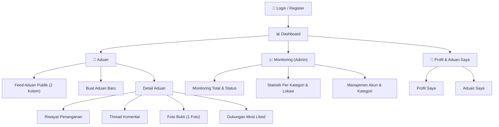
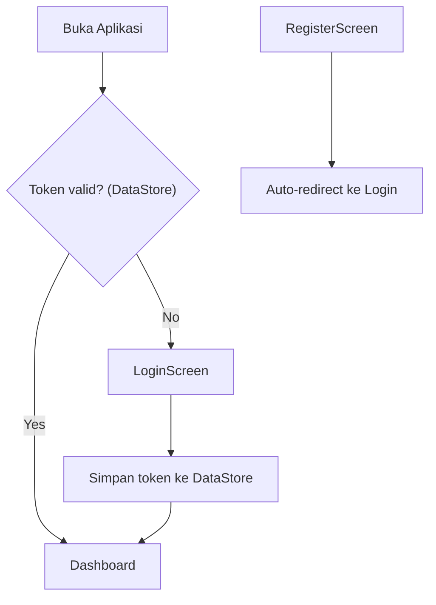
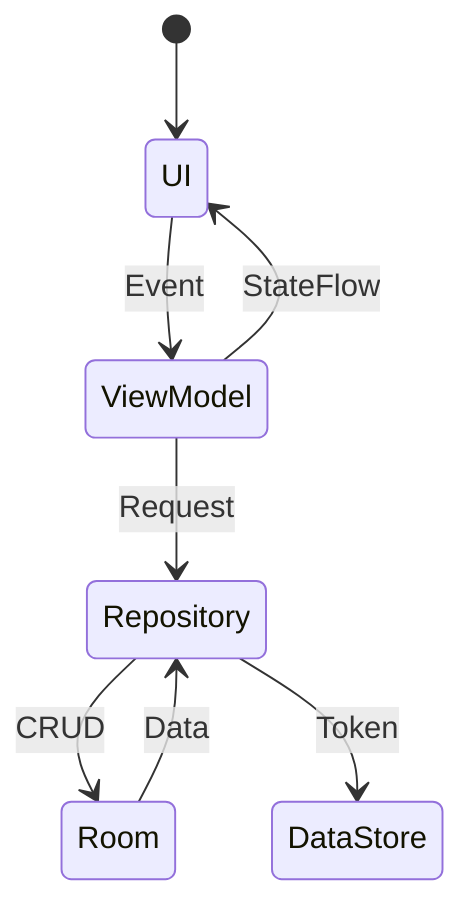

# APP_FLOW.md — Alur Aplikasi TiketBantu (Native Android — Jetpack Compose)

> **Stack**: Native Android (Kotlin) + Jetpack Compose. Data persisted locally with **Room** and **DataStore**. No external backend service.

---

## 📐 Sitemap Overview


```mermaid
graph TD
    A["🔐 Login / Register"] --> B["📊 Dashboard"]
    B --> C["🎫 Aduan"]
    B --> D["📈 Monitoring (Admin)"]
    B --> E["👤 Profil & Aduan Saya"]

    C --> C1["Feed Aduan Publik (2 Kolom)"]
    C --> C2["Buat Aduan Baru"]
    C --> C3["Detail Aduan"]

    C3 --> C3a["Riwayat Penanganan"]
    C3 --> C3b["Thread Komentar"]
    C3 --> C3c["Foto Bukti (1 Foto)"]
    C3 --> C3d["Dukungan Most Liked"]

    D --> D1["Monitoring Total & Status"]
    D --> D2["Statistik Per Kategori & Lokasi"]
    D --> D3["Manajemen Akun & Kategori"]

    E --> E1["Profil Saya"]
    E --> E2["Aduan Saya"]
```

---

## 🗂️ Route Structure (Navigation Compose — Type‑Safe)

```kotlin
// Auth Graph
Login           -> Halaman login (User / Agen / Admin)
Register        -> Pendaftaran akun pelapor (role default = User)

// Main Graph (Scaffold + BottomNavigation)
Dashboard       -> Feed aduan publik, layout 2 kolom (default Agen: sort = most_liked)
CreateTicket    -> Form buat aduan baru (FAB / quick action)
TicketDetail/{id} -> Detail aduan (read‑only + komentar + lampiran)
MyTickets       -> Aduan Saya (hanya aduan milik user login)
Profile         -> Profil & logout

// Admin Graph
Monitoring      -> Pure Monitoring Dashboard (Admin only)
UserManagement  -> Manajemen akun & kategori (Admin only)
```

---

## 🔐 Alur 1: Login, Register & Session (Auth)


```mermaid
flowchart TD
    Start["Buka Aplikasi"] --> CheckToken{"Token valid? (DataStore)"}
    CheckToken -- Yes --> Dashboard
    CheckToken -- No --> LoginScreen
    LoginScreen --> LoginSuccess["Simpan token ke DataStore"] --> Dashboard
    RegisterScreen --> RegisterSuccess["Auto‑redirect ke Login"]
```

* Login & Register are local forms; upon success, user credentials are validated against locally stored data (or mock repository) and a session token is stored in **DataStore**.

---

## 📊 Alur 2: Dashboard (Layout 2 Kolom)

- Left column: Feed aduan publik (lazy column, infinite scroll).
- Right column (tablet) or drawer (phone): Search, filter, sort (Most Liked / Terbaru), statistik.
- Role‑specific default sorting:
  - User: Terbaru
  - Agen: Most Liked
  - Admin: Monitoring view

---

## 🎫 Alur 3: Buat Aduan Baru

1. User taps **"➕ Buat Aduan"** (FAB or drawer action).
2. Form includes title, kategori, lokasi (gedung, lantai, ruangan), deskripsi, dan **opsional 1 foto** (JPG/PNG ≤5 MB).
3. On submit, ticket is saved locally via **Room** DAO.
4. Snackbar **"Aduan berhasil dibuat"** shown and user navigated to newly created **TicketDetail**.

---

## 🖐️ Alur 4: Claim Tugas oleh Agen (Linear Queue)

1. Agen melihat dashboard (default Most Liked).
2. Pilih aduan dengan status **Baru** dan tap **"Claim Tugas"**.
3. Lokal update ticket row: `agent_id = currentAgent`, `status = Diproses`.
4. UI updates card color to **🟡 Diproses** and Snackbar confirms claim.

> No admin assignment; agents claim tickets themselves.

---

## 🔄 Alur 5: Pembaruan Status Penanganan

- Pada **TicketDetail**, agen atau admin dapat mengubah status via dropdown (Selesai / Ditutup).
- Update persisted in **Room**; UI reflects badge change and moves ticket to bottom section.

---

## ❤️ Alur 6: Dukungan "Saya Juga Mengalami" (Most Liked)

- User taps heart icon on a ticket.
- Local counter increments in **Room** and UI updates instantly.
- Ticket moves up in **Most Liked** sorting.

---

## 💬 Alur 7: Thread Komentar (Polling via Coroutines)

- Comments are stored locally; new comment submission updates **Room** and UI.
- A `LaunchedEffect` with `while(true){ refreshComments(); delay(5000) }` polls the local repository to simulate realtime updates.

---

## 🔍 Alur 8: Search, Filter & Infinite Scroll

- Search and filter queries are applied to the local Room database.
- Pagination is handled by loading next page when scroll reaches near end.

---

## 📈 Alur 9: Monitoring Admin (Pure Monitoring)

- Admin sees aggregated statistics (total tickets, per‑kategori counts) calculated from local DB.
- No ticket assignment functionality.

---

## 🍞 Alur 10: Feedback UI (Snackbar / Toast)

- All user actions (login, create ticket, claim, status update, support, comment) provide immediate feedback via Compose **Snackbar** or **Toast**.
- No email or push notifications are used.

---

## 🗄️ Arsitektur & State Management (MVVM + UDF)


```mermaid
stateDiagram-v2
    [*] --> UI
    UI --> ViewModel : Event
    ViewModel --> Repository : Request
    Repository --> Room : CRUD
    Repository --> DataStore : Token
    Room --> Repository : Data
    ViewModel --> UI : StateFlow
```

- UI layer consists of **Composable** functions (stateless) receiving state from **ViewModel**.
- **ViewModel** holds `StateFlow` for UI state and processes events.
- **Repository** abstracts access to **Room** DB and **DataStore**.
- No network layer needed.

---

*Document updated to reflect the Android‑only implementation (Opsi 3). All backend/Retrofit references have been removed.*