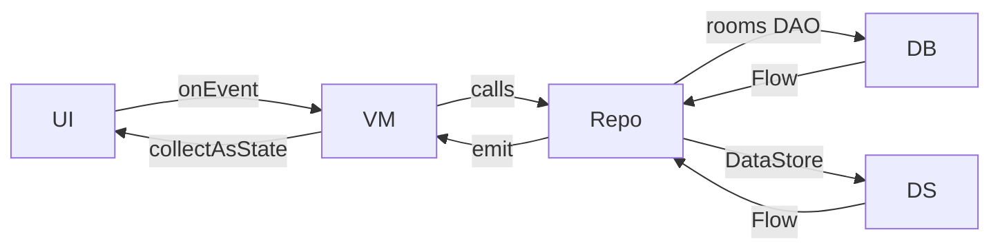

# ARCHITECTURE.md — Arsitektur Sistem TiketBantu Mobile

**Proyek Tugas Pemrograman Mobile — Pertemuan ke-8 (UTS)**

Adaptasi dari sistem web **TiketBantu** menjadi aplikasi **Android native** **tanpa backend** (Opsi 3). Semua data dikelola secara lokal di perangkat menggunakan **Room** untuk penyimpanan data utama dan **DataStore** untuk penyimpanan token/setting.

**Sumber Kebenaran (Source of Truth)**: `FEATURES_TiketBantu.md` & `APP_FLOW_TiketBantu.md`.

---

## 📐 High-Level Architecture (Android‑Only)

```mermaid
flowchart TB
    subgraph AndroidApp[Android App (Kotlin)]
        UI[Jetpack Compose UI] --> VM[ViewModel (StateFlow)]
        VM --> Repo[Repository Interface]
        Repo --> DB[(Room Database)]
        Repo --> DS[DataStore (Preferences)]
    end
```

Sistem terdiri dari satu komponen utama:
1. **Android App** – UI dibangun dengan Jetpack Compose.
2. **MVVM + Unidirectional Data Flow** – UI mengirim event ke ViewModel, yang mengeksekusi aksi melalui Repository dan memperbarui UI melalui `StateFlow`.
3. **Room** – Sumber data tunggal (single source of truth) untuk entitas `User`, `Ticket`, `Category`, `Comment`, `TicketSupport`.
4. **DataStore** – Menyimpan token autentikasi (jika diperlukan), preferensi, dan status login secara aman.

Tidak ada layanan backend, REST API, atau penyimpanan eksternal. Semua data bersifat persisten lokal pada perangkat.

---

## 🗄️ Skema Database Lokal (Room)

```kotlin
@Entity(tableName = "users")
data class User(
    @PrimaryKey val id: Long,
    val name: String,
    val email: String,
    val nimNip: String?,
    val passwordHash: String,
    val role: Role, // PELAPOR, AGEN, ADMIN
    val isActive: Boolean = true
)

@Entity(tableName = "categories")
data class Category(
    @PrimaryKey val id: Long,
    val name: String
)

@Entity(
    tableName = "tickets",
    foreignKeys = [
        ForeignKey(entity = User::class, parentColumns = ["id"], childColumns = ["reporterId"]),
        ForeignKey(entity = User::class, parentColumns = ["id"], childColumns = ["agentId"], onDelete = ForeignKey.SET_NULL),
        ForeignKey(entity = Category::class, parentColumns = ["id"], childColumns = ["categoryId"])
    ]
)
data class Ticket(
    @PrimaryKey val id: Long,
    val title: String,
    val description: String,
    val categoryId: Long,
    val locationBuilding: String,
    val locationFloor: String,
    val locationRoom: String,
    val status: TicketStatus, // BARU, DIPROSES, SELESAI, DITUTUP
    val imageUrl: String?, // local file path, nullable
    val reporterId: Long,
    val agentId: Long?, // null until claimed
    val createdAt: Long,
    val updatedAt: Long,
    val deletedAt: Long? // null = aktif, non‑null = soft‑delete (Trash)
)

@Entity(
    tableName = "ticket_support",
    primaryKeys = ["ticketId", "userId"],
    foreignKeys = [
        ForeignKey(entity = Ticket::class, parentColumns = ["id"], childColumns = ["ticketId"]),
        ForeignKey(entity = User::class, parentColumns = ["id"], childColumns = ["userId"])
    ]
)
data class TicketSupport(
    val ticketId: Long,
    val userId: Long,
    val createdAt: Long
)

@Entity(
    tableName = "comments",
    foreignKeys = [
        ForeignKey(entity = Ticket::class, parentColumns = ["id"], childColumns = ["ticketId"]),
        ForeignKey(entity = User::class, parentColumns = ["id"], childColumns = ["userId"])
    ]
)
data class Comment(
    @PrimaryKey val id: Long,
    val ticketId: Long,
    val userId: Long,
    val content: String,
    val createdAt: Long
)
```

**Catatan**: Kolom `priority` dihapus. Urgensi aduan dihitung otomatis dari jumlah dukungan (`TicketSupport`).

---

## 📱 Android App Architecture (MVVM + UDF)



### Layer Details
| Layer | Responsibility |
|------|----------------|
| **UI (Compose)** | Menampilkan layar, mengirimkan event UI ke ViewModel. |
| **ViewModel** | Menyimpan `StateFlow<UiState>`, memproses event, memanggil Repository. |
| **Repository** | Abstraksi akses data, menggabungkan Room DAO & DataStore, menyediakan `Flow`/`suspend` API. |
| **Room DAO** | Operasi CRUD pada tabel lokal. |
| **DataStore** | Penyimpanan token, preferensi, dan flag login. |

### Navigation
- **Auth Graph**: `LoginScreen`, `RegisterScreen` (hanya untuk role PELAPOR).  
- **Main Graph** (BottomNavigation) menyesuaikan tab berdasarkan `role`:
  - **Pelapor**: Feed, Buat Aduan, Profil.
  - **Agen**: Feed, Buat Aduan (disabled), Profil.
  - **Admin**: Feed, Buat Aduan, Monitoring, Profil.
- **Screen Arguments** menggunakan `@Serializable` route objects untuk type‑safe navigation.

---

## 🔐 Autentikasi & Otorisasi (Local)

1. Saat pendaftaran, data user disimpan ke tabel `users` dengan `role = PELAPOR` secara default.
2. Login memverifikasi `email + passwordHash` pada tabel `users`.
3. Token sederhana (misalnya JWT‑like string) disimpan di `DataStore` untuk mempertahankan sesi.
4. Setiap akses UI memeriksa `role` dari `User` yang sedang login untuk mengaktifkan/menonaktifkan fitur.

---

## 📂 Penyimpanan Foto

- Foto di‑pick via Jetpack Compose `PhotoPicker` (max 1 foto, JPG/PNG, ≤ 5 MB).
- Disimpan ke direktori internal aplikasi (`filesDir/ticket_photos/{ticketId}.jpg`).
- Path relatif disimpan di kolom `imageUrl` pada tabel `Ticket`.

---

## 📊 Fitur‑Fitur Utama (sesuai `FEATURES_TiketBantu.md`)
- **Feed Aduan** – `LazyColumn` dengan sorting `Most Liked` atau `Terbaru`.
- **Buat Aduan** – Form dengan optional foto, validasi field.
- **Dukungan "Saya Juga Mengalami"** – Toggle yang menambah/ menghapus baris pada tabel `ticket_support`.
- **Klaim Tiket (Agen)** – Agen dapat men‑claim tiket yang berstatus `BARU` (self‑claim, linear queue).
- **Status Linear** – `BARU → DIPROSES → SELESAI / DITUTUP`.
- **Soft Delete (Trash)** – Admin dapat meng‑soft‑delete tiket; data tetap ada di tabel dengan `deletedAt`.
- **Monitoring (Admin)** – Statistik sederhana diambil dari Room query (jumlah tiket per status, per kategori).

---

## 🚀 Deployment / Build
- Proyek dibangun menggunakan **Gradle** dengan plugin Android.
- Jalankan dengan `./gradlew assembleDebug` atau `./gradlew installDebug` untuk meng‑install ke emulator/device.
- Tidak ada server atau layanan cloud yang diperlukan.

---

## 📈 Batasan & Penyederhanaan
| Aspek | Keputusan Arsitektur |
|------|----------------------|
| **Penyimpanan Lampiran** | 1 kolom `imageUrl` (local file), tanpa storage eksternal. |
| **Notifikasi** | Snackbar/Toast lokal, tidak ada push notification. |
| **Realtime Updates** | Polling `Flow` dari Room (auto‑update) + manual refresh UI. |
| **Assignment Agen** | Self‑claim, tidak ada penugasan manual oleh Admin. |
| **Identitas** | Otentikasi lokal, tidak ada provider eksternal. |

---

## ✅ Kepatuhan Evaluasi Perkuliahan (UTS)
| No | Topik Perkuliahan | Implementasi di Arsitektur |
|---|-------------------|---------------------------|
| 1 | UI & Layout Dasar | Compose `Column`, `Row`, `Box`, `Modifier`. |
| 2 | Material Design 3 | Tema M3 (`Color.kt`, `Type.kt`). |
| 3 | State Management & UDF | `StateFlow` di ViewModel, unidirectional flow. |
| 4 | Lazy Layouts | `LazyColumn` untuk feed & komentar. |
| 5 | Networking & REST API | *Tidak ada* – semua data lokal (Room). |
| 6 | MVVM Architecture | Pemisahan UI‑ViewModel‑Repository‑Room. |
| 7 | Type‑Safe Navigation | `@Serializable` route objects, `NavHost`. |
```
