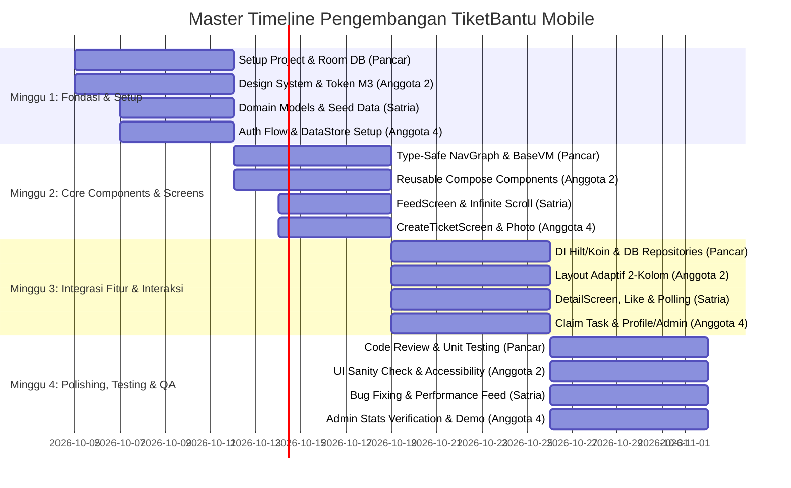

# 📋 Outline Pengembangan TiketBantu Mobile (Tim 4 Anggota)

Dokumen ini memuat pembagian tugas (*Job Description*), *Timeline* pengembangan, dan *Flowchart* teknis kerja untuk masing-masing dari 4 anggota tim pengembang aplikasi **TiketBantu Mobile**.

Aplikasi dibangun berbasis **Android Native (Jetpack Compose)** dengan arsitektur **MVVM + Unidirectional Data Flow (UDF)**, persistensi lokal **Room Database**, manajemen sesi **DataStore Preferences**, serta desain **Material Design 3 (M3) Adaptive Design** tanpa backend eksternal (Standalone).

---

## 🎯 Pemetaan 6 Aspek Teknis (Materi Jetpack Compose)

Proyek ini mengimplementasikan **6 materi teknis Native Android dengan Jetpack Compose**:

| No | Materi Teknis Wajib | Penerapan Konkret pada TiketBantu Mobile | Penanggung Jawab Utama |
|---|---|---|---|
| **1** | **UI & Layout Dasar** | Penggunaan `Column`, `Row`, `Box`, manipulasi `Modifier` (padding, fillMaxSize, weight, clip, clickable, border), serta perancangan antarmuka adaptif 2‑kolom (HP compact vs Tablet landscape). | **Anggota 2** & **Anggota 4** |
| **2** | **Material Design 3 (M3)** | Penerapan tema sistematis (`Color.kt`, `Type.kt`, `Shape.kt`, `Theme.kt`), komponen interaktif (`Button`, `OutlinedTextField`, `Card`, `FilterChip`), badge status dinamis (`✓ Selesai`), dan elevated surfaces. | **Anggota 2** |
| **3** | **State Management & UDF** | Pola *Unidirectional Data Flow* (UDF), penggunaan `remember`, `rememberSaveable`, *State Hoisting* pada komponen interaktif, serta sinkronisasi reactive `StateFlow` dari ViewModel ke UI Composable. | **Satria** & **Anggota 4** |
| **4** | **Lazy Layouts** | Penggunaan `LazyColumn` pada Feed Aduan Publik dan Daftar Aduan Saya dengan penanganan `key = { ticket.id }`, pagination / *infinite scroll*, pull‑to‑refresh, dan pemisahan blok tiket selesai di posisi bawah. | **Satria** |
| **5** | **Arsitektur Aplikasi (MVVM)** | Implementasi arsitektur Clean MVVM terstruktur (`data`, `domain`, `ui`), `BaseViewModel` berbasis coroutines, dan pengelolaan status tampilan terpadu `UiState` (`Idle`, `Loading`, `Success<T>`, `Error`). | **Pancar** *(Lead Architect)* |
| **6** | **Navigation Compose** | Navigasi multi‑screen (9 destinasi: Login, Register, Feed, Detail, Buat Aduan, Aduan Saya, Profil, Monitoring, User Management) berbasis **Type‑Safe Navigation** (`@Serializable`), pengiriman argumen `ticketId`, integrasi `Scaffold` & `BottomNavigation` adaptif per Role. | **Pancar** *(Lead Architect)* |

---

## 👥 Struktur Tim & Pembagian Peran

| No | Nama / Role | Fokus Utama | Materi Teknis yang Dipegang | Tanggung Jawab Utama |
|---|---|---|---|---|
| **1** | **Pancar**<br>(*Lead Architect & Core Infrastructure*) | Arsitektur MVVM, Room DB, Navigation & DI | • **Arsitektur Aplikasi (MVVM + UiState)**<br>• **Navigation Compose (Type‑Safe)** | Setup Clean Architecture modular, `BaseViewModel`, `UiState<T>`, `NavGraph.kt` (Type‑Safe routes), integrasi Room SQLite lokal, Dependency Injection (Koin), dan Code Review. |
| **2** | **Anggota 2**<br>(*UI/UX Designer & Compose Specialist*) | Design System M3 & Reusable Components | • **Material Design 3 (M3)**<br>• **UI & Layout Dasar (Adaptive)** | Pembuatan Theme Tokens M3 (Color, Typography, Shape), Reusable Components (`AppButton`, `AppTextField`, `AppTopBar`, `TicketCard`, `StatusBadge`), dan perancangan layout adaptif 2‑kolom. |
| **3** | **Satria**<br>(*Feature Engineer — Feed, Interaction & Polling*) | Feed, Most Liked, Detail Tiket & Polling | • **Lazy Layouts (`LazyColumn`)**<br>• **State Management & UDF** | Implementasi `LazyColumn` ber‑parameter `key`, logika pengurutan *Most Liked* ("Saya Juga Mengalami"), Thread Komentar, Coroutines Polling loop, dan status linear agen. |
| **4** | **Anggota 4**<br>(*Feature Engineer — Auth, Form, Profile & Admin*) | Auth, Form Aduan, Profil & Admin Monitoring | • **UI & Layout Dasar (Form Controls)**<br>• **State Management (`rememberSaveable`)** | Validasi form autentikasi (Login/Register 3 role), sesi DataStore, formulir buat aduan + image picker 1 foto, dialog claim agen, dan Pure Monitoring Dashboard Admin. |

---

## 📅 Master Timeline Pengembangan (4 Minggu / 1 Bulan)



---

## 📌 Rincian Job Description, Timeline & Flowchart Tiap Anggota

```text
================================================================
ANGGOTA 1: PANCAR (Lead Architect & Core Infrastructure)
================================================================

### 1. Job Description — Anggota 1 (Pancar)
| No | Fokus Kerja | Rincian Tugas | Deliverable & Output | Target Waktu |
|---|---|---|---|---|
| **1.1** | **Project Setup & Architecture** | Inisialisasi struktur package (`data`, `domain`, `ui`, `navigation`, `di`), integrasi Gradle dependencies (Compose, Room, DataStore, Coroutines, Serialization). | Repositori bersih dan modular sesuai pola Clean MVVM. | Minggu 1 (Hari 1‑3) |
| **1.2** | **Room Database Infrastructure** | Konfigurasi `AppDatabase`, buat entitas tabel (`users`, `tickets`, `categories`, `ticket_supports`, `comments`), migration builder, dan database pre‑population/seeder. | Database SQLite lokal siap pakai dengan mock awal data kampus. | Minggu 1 (Hari 4‑7) |
| **1.3** | **State Engine & Base ViewModel** | Membuat sealed interface `UiState<T>` (`Loading`, `Success<T>`, `Error`), `BaseViewModel` berbasis `StateFlow`, dan shared state holder untuk session. | Standar state management UDF yang seragam untuk developer lain. | Minggu 2 (Hari 8‑10) |
| **1.4** | **Type‑Safe Navigation Graph** | Mengimplementasikan Jetpack Compose Navigation dengan `@Serializable` route destination (`Login`, `Register`, `Dashboard`, `CreateTicket`, `Detail/{id}`, `Profile`, `Monitoring`, `UserManagement`). | `NavGraph.kt` yang type‑safe dan anti‑crash antar‑layar. | Minggu 2 (Hari 11‑14) |
| **1.5** | **Dependency Injection** | Setup module DI (Hilt atau Koin) untuk singleton Room Database, DAO injection, DataStore, dan ViewModel injection. | `AppModule.kt` yang mengotomatisasi injeksi dependency ke ViewModel. | Minggu 3 (Hari 15‑18) |
| **1.6** | **Code Review, Testing & Guardrails** | Review Pull Request, enforce standar kode, unit testing pada database DAO & Repository, serta persiapan rilis APK/AAB tugas akhir. | Kode bebas regresi dan siap didemonstrasikan. | Minggu 4 (Hari 22‑28) |
```

...(Bagian untuk Anggota 2, 3, 4 tetap sama seperti pada outline asli)...

---

## 📦 **Fitur Tambahan yang Sudah Di‑implementasi di Proyek (tidak tercantum dalam outline asli)**

| Fitur | Deskripsi Singkat | File / Komponen Kode | Keterangan |
|---|---|---|---|
| **Monitoring Dashboard (Admin)** | Dashboard statistik admin: header, status sync, periode statistik, distribusi kategori, prioritas tiket, aksi master‑data. | `MonitoringScreen.kt` (ui/screens/monitoring) | **Tidak terdokumentasi** pada outline. |
| **Feed List (daftar tiket publik)** | Daftar tiket dengan filter status, pencarian, pull‑to‑refresh, infinite scroll. | `FeedScreen.kt` (ui/screens/feed) | **Tidak terdokumentasi** pada outline. |
| **Buat Aduan (Create Ticket)** | Form lengkap: judul, deskripsi, kategori, lokasi, image‑picker (satu foto), submit. | `CreateTicketScreen.kt` (ui/screens/create) | **Tidak terdokumentasi** pada outline. |
| **Auth Screens (Login / Register)** | UI login & register multi‑role (Pelapor, Agen, Admin) dengan validasi, toggle password, error handling. | `LoginScreen.kt` & `RegisterScreen.kt` (ui/screens/auth) | **Tidak terdokumentasi** pada outline. |
| **App Navigation (Top‑Bar & Bottom‑Bar)** | Komponen navigasi utama adaptif per role, badge tiket pada bottom‑bar. | `AppTopBar.kt`, `BottomNavigationBar.kt` (ui/components) | **Tidak terdokumentasi** pada outline. |
| **Design System (warna, tipografi, token spacing)** | Definisi warna brand, style teks, dimensi, serta komponen dasar Material‑3. | `Color.kt`, `Type.kt`, `Shape.kt`, `Theme.kt` (ui/theme) | **Tidak terdokumentasi** pada outline. |
| **Quick Shortcuts & Navigasi (Aksi Cepat & Navigasi)** | Kartu `QuickShortcutsCard` dengan tiga shortcut: *Aduan Saya*, *Aduan Saya Dukung*, *Buat Aduan Baru*. | `QuickShortcutsCard.kt`, `ShortcutTile.kt` (ui/components) | **Tidak terdokumentasi** pada outline. |
| **Role Switcher** | UI untuk berpindah peran (Pelapor ↔ Agen ↔ Admin) secara dinamis dalam mode demo. | `RoleSwitcherCard.kt` (ui/components) | **Tidak terdokumentasi** pada outline. |
| **User Stats Card** | Menampilkan tiga statistik utama pengguna (aduan terkirim, dukungan, selesai). | `UserStatsCard.kt` (ui/components) | **Tidak terdokumentasi** pada outline. |
| **Help & Info Card** | Bagian bantuan & layanan kampus dengan dua shortcut (Panduan & Kontak). | `HelpAndInfoCard.kt` (ui/components) | **Tidak terdokumentasi** pada outline. |
| **Logout Card & Dialog** | Tombol logout dengan dialog konfirmasi. | `LogoutCard.kt`, `AlertDialog` (ui/components) | **Tidak terdokumentasi** pada outline. |
| **Guide & Contact Dialogs** | Dialog panduan penggunaan aplikasi & dialog kontak unit sarpras. | `GuideDialog.kt`, `ContactDialog.kt` (ui/components) | **Tidak terdokumentasi** pada outline. |
| **Komponen UI Umum Tambahan** | `GlassCard`, `InitialsAvatar`, `TagChip`, `StatItem`, `ContactItem`, ds. | Berbagai file di `ui/components` | **Tidak tercantum** dalam outline. |

---

> **Catatan:** Bagian di atas menambah informasi pada outline asli tanpa mengubah tanggung‑jawab yang telah didefinisikan. Jika diperlukan alokasi tugas baru, dapat disesuaikan ke anggota yang relevan.

*Dokumen ini merupakan duplikat yang telah diperkaya dengan catatan fitur‑fitur tambahan yang sudah ada di kode basis proyek.*
