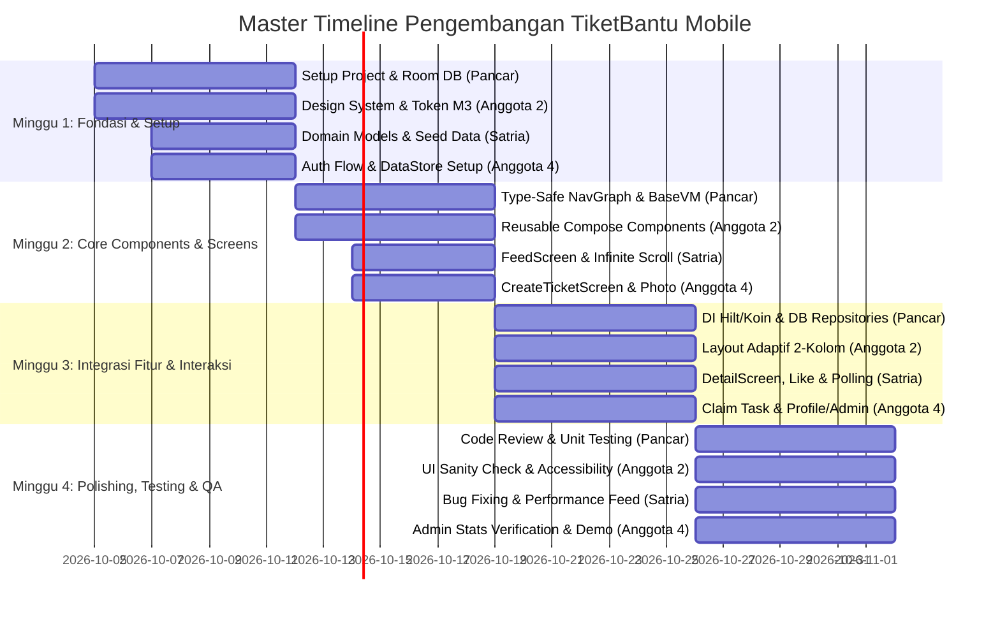
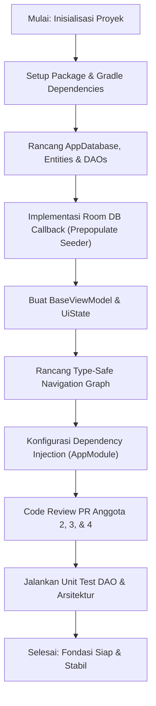
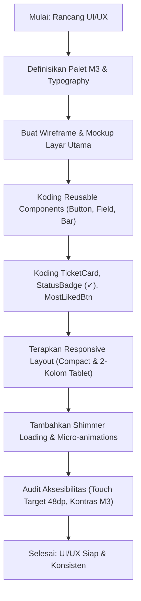
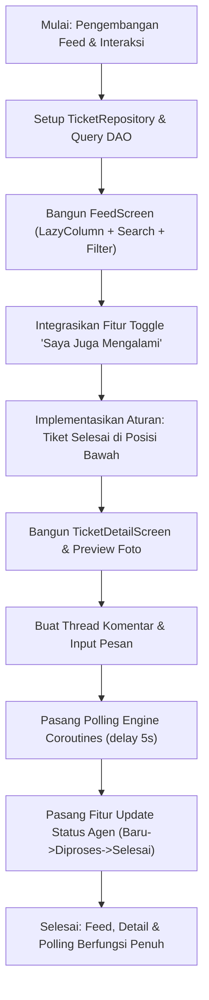
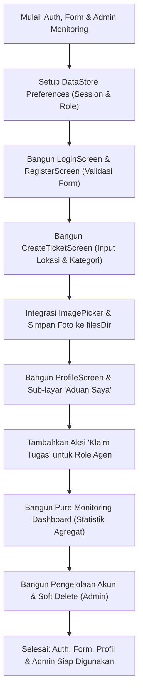
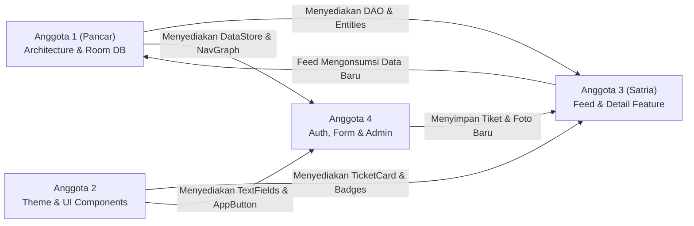

# 📋 Outline Pengembangan TiketBantu Mobile (Tim 4 Anggota)

Dokumen ini memuat pembagian tugas (*Job Description*), *Timeline* pengembangan, dan *Flowchart* teknis kerja untuk masing-masing dari 4 anggota tim pengembang aplikasi **TiketBantu Mobile**.

Aplikasi dibangun berbasis **Android Native (Jetpack Compose)** dengan arsitektur **MVVM + Unidirectional Data Flow (UDF)**, persistensi lokal **Room Database**, manajemen sesi **DataStore Preferences**, serta desain **Material Design 3 (M3) Adaptive Design** tanpa backend eksternal (Standalone).

---

## 👥 Struktur Tim & Pembagian Peran

| No | Nama / Role | Fokus Utama | Tanggung Jawab Utama |
|---|---|---|---|
| **1** | **Pancar**<br>*(Lead Architect & Core Infrastructure)* | Arsitektur MVVM, Room DB, Navigation & DI | Fondasi arsitektur, setup Room SQLite, Type-Safe Navigation Graph, BaseViewModel/UiState, Dependency Injection, dan Code Review. |
| **2** | **Anggota 2**<br>*(UI/UX Designer & Compose Specialist)* | Design System M3 & Reusable Components | Design Tokens (Color, Typography, Shape), Reusable UI Components, Badge Status (`✓ Selesai`), Micro-animations, dan layout adaptif 2-kolom. |
| **3** | **Satria**<br>*(Feature Engineer — Feed, Interaction & Polling)* | Feed, Most Liked, Detail Tiket & Polling | Tampilan Feed Publik (`LazyColumn`), sistem *Most Liked* ("Saya Juga Mengalami"), Detail Aduan, Thread Komentar, Polling Coroutine, dan Linear Status Agen. |
| **4** | **Anggota 4**<br>*(Feature Engineer — Auth, Form, Profile & Admin)* | Auth, Form Aduan, Profil & Admin Monitoring | Login & Register Multi-Role (3 Role), Sesi DataStore, Form Buat Aduan + 1 Lampiran Foto lokal, Layar Profil/Aduan Saya, dan Pure Monitoring Dashboard Admin. |

---

## 🗓️ Master Timeline Pengembangan (4 Minggu / 1 Bulan)



---

## 📌 Rincian Job Description, Timeline & Flowchart Tiap Anggota

```
================================================================================
ANGGOTA 1: PANCAR (Lead Architect & Core Infrastructure)
================================================================================
```

### 1. Job Description — Anggota 1 (Pancar)

| No | Fokus Kerja | Rincian Tugas | Deliverable & Output | Target Waktu |
|---|---|---|---|---|
| **1.1** | **Project Setup & Architecture** | Inisialisasi struktur package (`data`, `domain`, `ui`, `navigation`, `di`), integrasi Gradle dependencies (Compose, Room, DataStore, Coroutines, Serialization). | Repositori bersih dan modular sesuai pola Clean MVVM. | Minggu 1 (Hari 1-3) |
| **1.2** | **Room Database Infrastructure** | Konfigurasi `AppDatabase`, buat entitas tabel (`users`, `tickets`, `categories`, `ticket_supports`, `comments`), migration builder, dan database pre-population/seeder. | Database SQLite lokal siap pakai dengan mock awal data kampus. | Minggu 1 (Hari 4-7) |
| **1.3** | **State Engine & Base ViewModel** | Membuat sealed interface `UiState<T>` (`Loading`, `Success<T>`, `Error`), `BaseViewModel` berbasis `StateFlow`, dan shared state holder untuk session. | Standar state management UDF yang seragam untuk developer lain. | Minggu 2 (Hari 8-10) |
| **1.4** | **Type-Safe Navigation Graph** | Mengimplementasikan Jetpack Compose Navigation dengan `@Serializable` route destination (`Login`, `Register`, `Dashboard`, `CreateTicket`, `Detail/{id}`, `Profile`, `Monitoring`). | `NavGraph.kt` yang type-safe dan anti-crash antar-layar. | Minggu 2 (Hari 11-14) |
| **1.5** | **Dependency Injection** | Setup module DI (Hilt atau Koin) untuk singleton Room Database, DAO injection, DataStore, dan ViewModel injection. | `AppModule.kt` yang mengotomatisasi injeksi dependency ke ViewModel. | Minggu 3 (Hari 15-18) |
| **1.6** | **Code Review, Testing & Guardrails** | Review Pull Request, enforce standar kode, unit testing pada database DAO & Repository, serta persiapan rilis APK/AAB tugas akhir. | Kode bebas regresi dan siap didemonstrasikan. | Minggu 4 (Hari 22-28) |

### 2. Flowchart Kerja — Anggota 1 (Pancar)



---

```
================================================================================
ANGGOTA 2: ANGGOTA 2 (UI/UX Designer & Compose Design System Specialist)
================================================================================
```

### 1. Job Description — Anggota 2

| No | Fokus Kerja | Rincian Tugas | Deliverable & Output | Target Waktu |
|---|---|---|---|---|
| **2.1** | **Design System M3 & Tokens** | Menentukan Color Palette M3 (*Cobalt Blue*, *Cyan*, *Emerald Green* untuk selesai), tipografi Roboto/Plus Jakarta Sans, Spacing scale (4/8dp grid), dan Shape tokens. | `Color.kt`, `Type.kt`, `Shape.kt`, `Theme.kt` di package `ui/theme/`. | Minggu 1 (Hari 1-4) |
| **2.2** | **Wireframe & Component Specs** | Menyusun visual wireframe & spesifikasi komponen di Figma/Dokumen (`DESIGN_TiketBantu.md`) untuk handoff ke tim developer. | Spesifikasi visual antarmuka dan preview komponen. | Minggu 1 (Hari 5-7) |
| **2.3** | **Reusable Core UI Components** | Mengembangkan komponen Compose umum: `AppButton`, `AppTextField`, `AppTopBar`, `BottomNavigationBar` adaptif per Role, dialog konfirmasi. | File Composable di package `ui/components/` lengkap dengan `@Preview`. | Minggu 2 (Hari 8-11) |
| **2.4** | **Specialized TiketBantu Components** | Membuat komponen khas: `TicketCard`, `StatusBadge` (dengan tanda khusus `✓ Selesai`), `MostLikedButton` ("Saya Juga Mengalami" toggle & counter). | Komponen siap pakai untuk Feed dan Detail Screen. | Minggu 2 (Hari 12-14) |
| **2.5** | **Micro-animations & Transitions** | Menambahkan transisi navigasi (*fade/slide*), ripple effect pada tombol like/dukungan, dan skeleton loading state (`ShimmerEffect`). | Interaksi UI terasa halus, modern, dan responsif. | Minggu 3 (Hari 15-18) |
| **2.6** | **Adaptive 2-Column Layout** | Mengimplementasikan layout adaptif: 1 kolom untuk ponsel (<600dp) dan 2 kolom (*Feed List + Sidebar Filter/Stats*) untuk tablet (≥600dp). | Tampilan responsif optimal di semua ukuran layar Android. | Minggu 3 (Hari 19-21) |
| **2.7** | **UI Quality Assurance & Accessibility** | Cek kontras warna (WCAG AA), kelayakan touch target minimal 48dp, audit `contentDescription` untuk TalkBack, dan pixel-perfect check. | Laporan audit visual dan perbaikan UI final. | Minggu 4 (Hari 22-28) |

### 2. Flowchart Kerja — Anggota 2



---

```
================================================================================
ANGGOTA 3: SATRIA (Feature Engineer — Feed, Interaction & Polling)
================================================================================
```

### 1. Job Description — Anggota 3 (Satria)

| No | Fokus Kerja | Rincian Tugas | Deliverable & Output | Target Waktu |
|---|---|---|---|---|
| **3.1** | **Repository & DAO Binding** | Menyusun `TicketRepository` dan `TicketDao` untuk query tiket: sorting `most_liked` vs `terbaru`, filter kategori/status, dan pencarian teks. | Layer data query tiket Room yang reaktif berbasis `Flow`. | Minggu 1 (Hari 3-7) |
| **3.2** | **Feed Screen (`LazyColumn`)** | Membuat `FeedViewModel` dan `FeedScreen` dengan `LazyColumn`, pull-to-refresh, pencarian terintegrasi, dan pemisahan tiket `Selesai` ke blok bawah. | Layar utama feed aduan publik dengan infinite scroll. | Minggu 2 (Hari 8-11) |
| **3.3** | **Sistem Dukungan Most Liked** | Menghubungkan tombol "Saya Juga Mengalami" dengan tabel `ticket_supports`: toggle dukungan satu-klik per user, increment counter, dan re-sort instan. | Fungsionalitas akumulasi urgensi publik tanpa prioritas manual. | Minggu 2 (Hari 12-14) |
| **3.4** | **Ticket Detail Screen** | Mengembangkan `TicketDetailViewModel` dan `TicketDetailScreen`: info komprehensif aduan, riwayat status, foto bukti terlampir, dan identitas pelapor. | Layar detail tiket yang bersih dan informatif. | Minggu 3 (Hari 15-17) |
| **3.5** | **Thread Komentar & Polling Engine** | Menampilkan daftar komentar aduan, form kirim komentar lokal, serta simulasi update real-time menggunakan Kotlin Coroutines `LaunchedEffect` (polling per 5 detik). | Thread komentar interaktif yang otomatis ter-refresh. | Minggu 3 (Hari 18-21) |
| **3.6** | **Linear Status Update Agen** | Menambahkan aksi pembaruan status (`Diproses` → `Selesai` / `Ditutup`) khusus untuk akun Agen pada halaman detail tiket. | Alur penanganan aduan linier yang terkunci setelah selesai. | Minggu 3 (Hari 20-21) |
| **3.7** | **Optimasi Feed & Testing** | Profiling performa rendering `LazyColumn`, testing konkurensi dukungan ganda, serta integrasi feedback Snackbar/Toast. | Modul feed & detail stabil tanpa lag atau jank. | Minggu 4 (Hari 22-28) |

### 2. Flowchart Kerja — Anggota 3 (Satria)



---

```
================================================================================
ANGGOTA 4: ANGGOTA 4 (Feature Engineer — Auth, Form, Profile & Admin)
================================================================================
```

### 1. Job Description — Anggota 4

| No | Fokus Kerja | Rincian Tugas | Deliverable & Output | Target Waktu |
|---|---|---|---|---|
| **4.1** | **Autentikasi Multi-Role & DataStore** | Membangun `AuthRepository` menggunakan `DataStore Preferences`: simpan token sesi lokal, simpan data user aktif, dan logika login 3 role (Pelapor, Agen, Admin). | Sesi login tersimpan permanen saat aplikasi ditutup/dibuka. | Minggu 1 (Hari 3-7) |
| **4.2** | **Login & Register Screen** | Membuat `LoginScreen` dan `RegisterScreen`: validasi field formulir (NIM/NIP, email, password), toggle password visibility, dan error state. | Autentikasi lokal multi-role berfungsi mulus. | Minggu 2 (Hari 8-11) |
| **4.3** | **Form Buat Aduan + 1 Foto** | Membuat `CreateTicketScreen`: input judul, deskripsi, pemilihan kategori (dropdown), input lokasi (gedung, lantai, ruang), dan image picker 1 foto (JPG/PNG <= 5MB). | Formulir pelaporan publik yang terintegrasi dengan penyimpanan foto internal. | Minggu 2 (Hari 12-14) |
| **4.4** | **Penyimpanan Foto Lokal (`filesDir`)** | Menangani kompresi dan penyimpanan file gambar yang dipilih ke direktori privat aplikasi (`filesDir/ticket_photos/{id}.jpg`), serta mencatat path-nya ke Room DB. | Lampiran foto tersimpan aman tanpa dependensi storage eksternal. | Minggu 3 (Hari 15-17) |
| **4.5** | **Profile Screen & Layar "Aduan Saya"** | Membangun `ProfileScreen`: kartu info pengguna, tombol Logout aman (clear DataStore), dan akses navigasi menuju daftar "Aduan Saya" (filter tiket milik user login). | Halaman profil dan riwayat laporan pribadi. | Minggu 3 (Hari 18-19) |
| **4.6** | **Linear Auto-Claim Agen** | Membuat tombol dan dialog konfirmasi "Klaim Tugas" untuk akun Agen pada tiket berstatus `Baru` (mengubah `agent_id` dan status ke `Diproses`). | Agen dapat mengambil tugas secara mandiri dari feed/detail. | Minggu 3 (Hari 20-21) |
| **4.7** | **Pure Monitoring Dashboard Admin** | Membangun layar `MonitoringScreen` khusus Admin: visualisasi kartu ringkasan (Total Baru, Diproses, Selesai), sebaran per kategori, dan User Management. | Dashboard monitoring eksekutif tanpa penugasan manual. | Minggu 4 (Hari 22-25) |
| **4.8** | **Final Testing & Integrasi Handoff** | Uji coba end-to-end skenario 3 role, verifikasi soft-delete tiket oleh Admin, dan memastikan semua feedback menggunakan Snackbar/Toast. | Seluruh modul auth, form, profil, dan admin terverifikasi 100%. | Minggu 4 (Hari 26-28) |

### 2. Flowchart Kerja — Anggota 4



---

## 🔄 Matriks Ketergantungan Antar Anggota (Dependency Matrix)



1. **Anggota 1 & Anggota 2** bekerja secara paralel di Minggu 1 untuk menyediakan fondasi backend lokal (Room DB) dan fondasi visual (Theme M3 & Components).
2. **Anggota 3 & Anggota 4** mengonsumsi komponen dari Anggota 2 dan Entity/DAO dari Anggota 1 untuk membangun fitur utama pada Minggu 2 & 3.
3. Seluruh anggota bergabung pada Minggu 4 untuk melakukan integrasi akhir, pengujian skenario 3 role, penyesuaian tata letak adaptif, dan finalisasi dokumentasi.